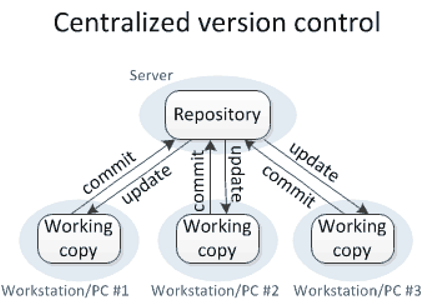
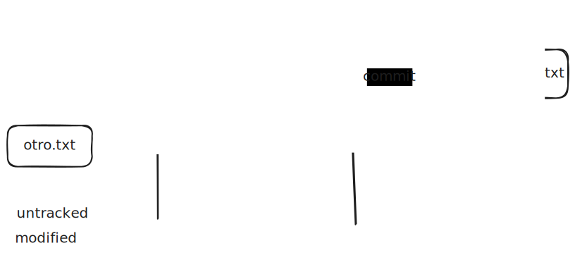
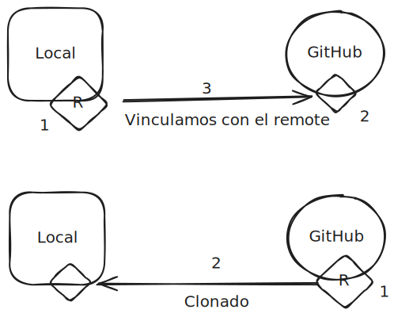
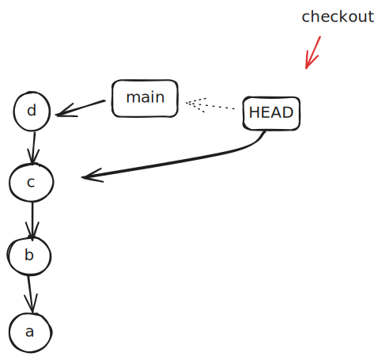
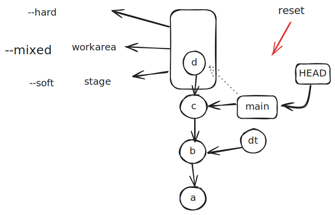
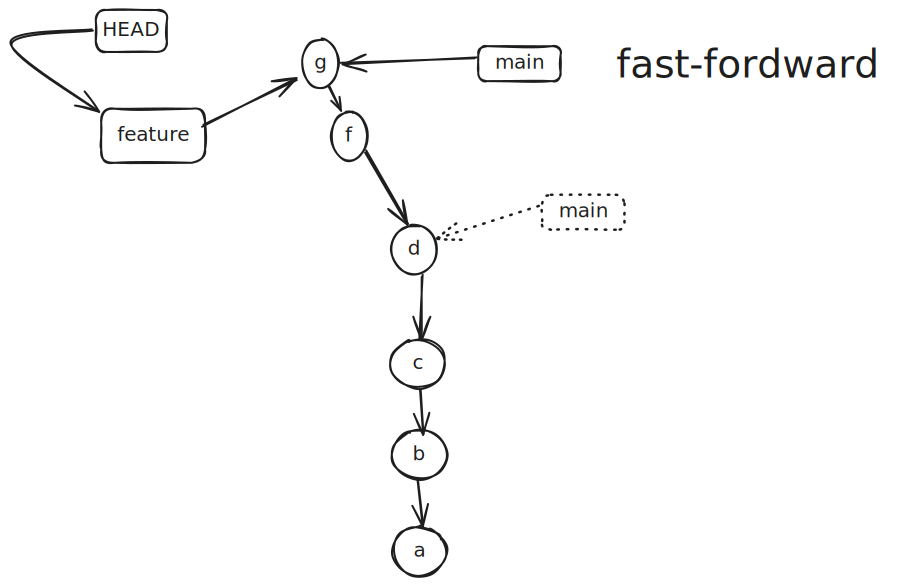
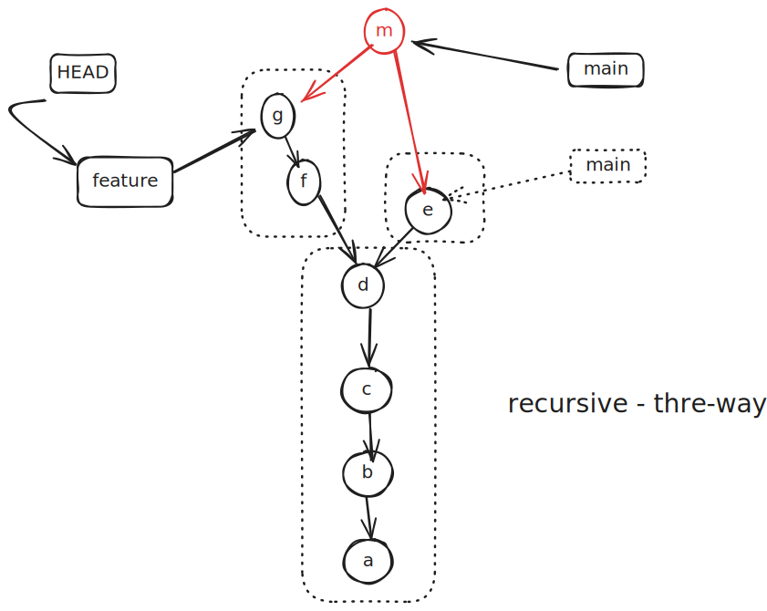
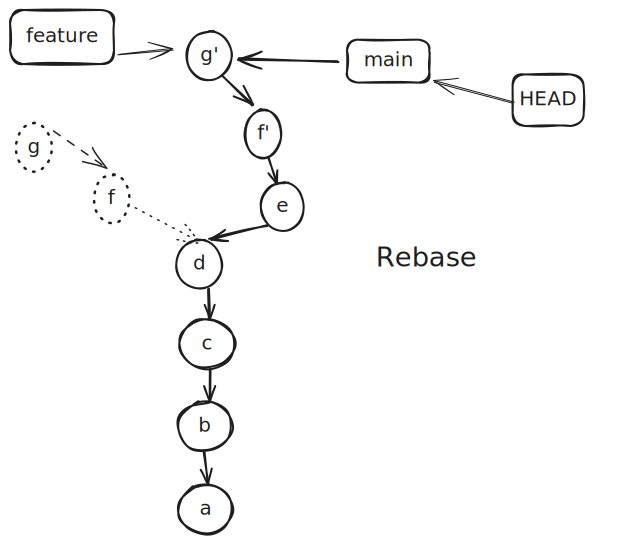
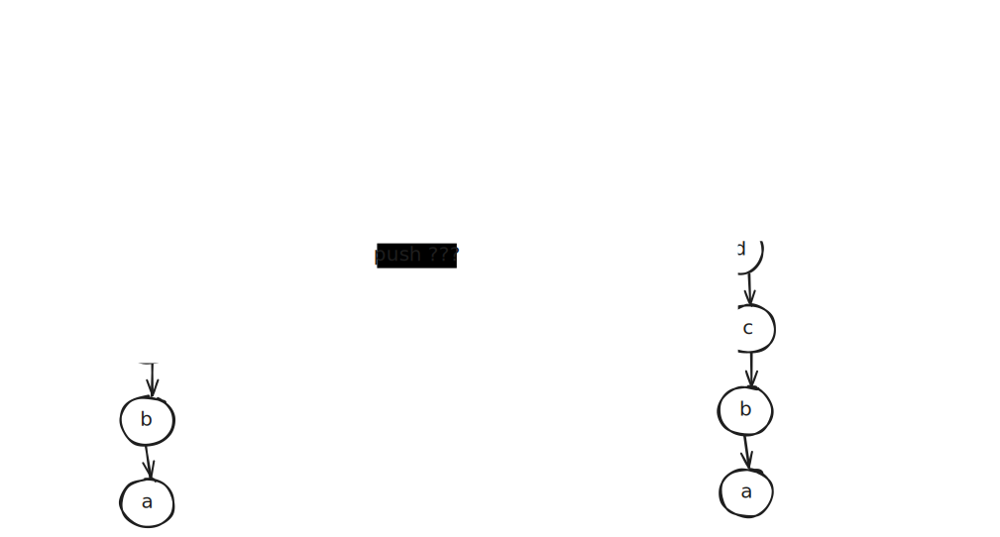

- [Introducción](#introducción)
  - [Qué es un SCV](#qué-es-un-scv)
  - [Tipos de SCV: centralizados y distribuidos](#tipos-de-scv-centralizados-y-distribuidos)
  - [Git: un SCV distribuido: Historia de GIT](#git-un-scv-distribuido-historia-de-git)
  - [Características de Git como SCV distribuido](#características-de-git-como-scv-distribuido)
- [Instalación y configuración inicial](#instalación-y-configuración-inicial)
  - [Terminales](#terminales)
    - [PowerShell](#powershell)
    - [El comando less](#el-comando-less)
  - [Configuración](#configuración)
- [Referencias](#referencias)
- [Quick Start](#quick-start)
  - [Comandos básicos de Git](#comandos-básicos-de-git)
  - [Primeros pasos](#primeros-pasos)
    - [Primer repo (init)](#primer-repo-init)
    - [Anatomía de un repositorio git: staging area, index and cache](#anatomía-de-un-repositorio-git-staging-area-index-and-cache)
    - [Añadir contenidos al repositorio. Primer commit](#añadir-contenidos-al-repositorio-primer-commit)
    - [Git add](#git-add)
    - [Git status](#git-status)
    - [Git commit. Mensajes de commit](#git-commit-mensajes-de-commit)
    - [git log / git show](#git-log--git-show)
- [AAprendiendo a referenciar revisiones y paths](#aaprendiendo-a-referenciar-revisiones-y-paths)
  - [Anatomía de comandos típicos, referencias vs paths](#anatomía-de-comandos-típicos-referencias-vs-paths)
  - [Paths](#paths)
  - [Tipos de referencias](#tipos-de-referencias)
  - [Referencias simbólicas](#referencias-simbólicas)
  - [Referencias relativas](#referencias-relativas)
- [Integración con otras herramientas y entornos](#integración-con-otras-herramientas-y-entornos)
  - [Clientes gráficos](#clientes-gráficos)
  - [Entornos de desarrollo](#entornos-de-desarrollo)
    - [VSCode](#vscode)
  - [Repositorios remotos (hosting de repositorios)](#repositorios-remotos-hosting-de-repositorios)
  - [Comandos de conexión y uso del repositorio remoto (resumen)](#comandos-de-conexión-y-uso-del-repositorio-remoto-resumen)
- [Herramientas para preparar un buen commit en cualquier situación](#herramientas-para-preparar-un-buen-commit-en-cualquier-situación)
  - [Comprobar el repositorio. Git log](#comprobar-el-repositorio-git-log)
  - [Alias](#alias)
  - [Operaciones en la Staging Area (Index)](#operaciones-en-la-staging-area-index)
    - [Añadir ficheros](#añadir-ficheros)
    - [Eliminar de la Staging Area (Index)](#eliminar-de-la-staging-area-index)
  - [Eliminar ficheros](#eliminar-ficheros)
    - [Problemas con .gitignore](#problemas-con-gitignore)
  - [Cambiar nombre de ficheros](#cambiar-nombre-de-ficheros)
  - [git diff](#git-diff)
  - [git blame](#git-blame)
- [Recapitulando: Git básico](#recapitulando-git-básico)
- [Reescribiendo la historia](#reescribiendo-la-historia)
  - [Advertencia](#advertencia)
  - [git checkout](#git-checkout)
    - [git checkout a nivel de archivo](#git-checkout-a-nivel-de-archivo)
  - [git reset](#git-reset)
    - [git reset a nivel de archivo](#git-reset-a-nivel-de-archivo)
  - [Ref logs](#ref-logs)
- [Trabajando en paralelo](#trabajando-en-paralelo)
  - [Ramas (branches)](#ramas-branches)
  - [Combinación de ramas: Merge y Rebase](#combinación-de-ramas-merge-y-rebase)
    - [Merge fast-forward](#merge-fast-forward)
    - [Merge recursive](#merge-recursive)
    - [Rebase](#rebase)
  - [Resolución de conflictos](#resolución-de-conflictos)
- [Repositorios remotos](#repositorios-remotos)
  - [¿Qué son los repositorios remotos?](#qué-son-los-repositorios-remotos)
  - [Clonado de repositorios](#clonado-de-repositorios)
  - [Git remote](#git-remote)
    - [Operaciones con git remote](#operaciones-con-git-remote)
  - [Operaciones con repositorios remotos](#operaciones-con-repositorios-remotos)
    - [Git push](#git-push)
    - [Git pull](#git-pull)
  - [Pull Request](#pull-request)
    - [Configuración de las ramas y PR](#configuración-de-las-ramas-y-pr)
    - [Actualizaciones de las ramas feature](#actualizaciones-de-las-ramas-feature)
- [Buenas prácticas](#buenas-prácticas)

Git es un sistema de control de versiones distribuido que fue creado por Linus Torvalds en 2005 para el desarrollo del kernel de Linux. Es un sistema de control de versiones escrito mayoritariamente en C, de código abierto y gratuito que es muy rápido y eficiente

## Introducción

### Qué es un SCV

Los sistemas de control de versiones (SCV) son una herramienta esencial para manejar proyectos de software; lo que ha hecho de ellos herramientas de uso habitual en el desarrollo profesional de software desde hace décadas.

Proporcionan una serie de funcionalidades claves para el desarrollo de proyectos como es

- el control de cambios en el código,
- la reversibilidad de dichos cambios,
- la posibilidad de colaborar en el desarrollo del código.

Además, los SCV permiten tener en paralelo varias versiones o ramas del proyecto. Las ramas se utilizan para desarrollar funcionalidades aisladas de los cambios en otras partes del proyecto que posteriormente pueden integrarse en la rama principal.

### Tipos de SCV: centralizados y distribuidos

Los **SCV centralizados** como CVS y Subversion (SVN) son sistemas cliente-servidor donde hay un repositorio canónico en el servidor que contiene toda la información de los cambios mientras que los clientes solo tienen copias de trabajo.



En **sistemas distribuidos** como Mercurial y Git no existe el concepto de repositorio canónico por lo que cada cliente ha de tener una copia completa del repositorio. Desde 2010, la tendencia es utilizar cada vez más SCV distribuidos, en particular Git


### Git: un SCV distribuido: Historia de GIT

Git es un sistema de control de versiones distribuido que fue creado por _Linus Torvalds_ en 2005 para el desarrollo del kernel de Linux. Es un sistema de control de versiones escrito mayoritariamente en **C**, de **código abierto** y **gratuito** que es muy rápido y eficiente.

Git es un software diseñado pensando en la **eficiencia** y la **confiabilidad** del mantenimiento de versiones y aplicaciones cuando éstas tienen un **gran número de archivos** de código fuente.

En comparación con otros sistemas de control de versiones, Git es más rápido y tiene un tamaño de repositorio más pequeño. También tiene una **escalabilidad** muy buena, lo que significa que puede manejar proyectos muy grandes y muy pequeños.

En el contexto en el que fue diseñado, las dos principales opciones eran SVN y Mercurial. Git se diseñó para ser más rápido y eficiente que Mercurial, aunque conservando su estrategia de SVC distribuido, y más fácil de usar que SVN.

### Características de Git como SCV distribuido

La experiencia del equipo de _Linus Torvalds_ en la gestión de la integración de las diferentes aportaciones en un proyecto distribuido de la magnitud del kernel de Linux determinó los objetivos del proyecto

- Rapidez
- Simplicidad de uso
- Multiplicidad de versiones (Ramas)
- Distribuido: capaz de trabajar sin conexiones
- Preparado para grandes proyectos

Estos objetivos se reflejaron en las siguientes decisiones de implementación:

**Versiones no incrementales**. Git almacena cada cambio como una instantánea de todos los archivos del proyecto. Para ser eficiente, si el archivo no ha sido modificado, sólo se almacena un enlace al archivo idéntico previamente almacenado. Los SCV anteriores a Git habitualmente almacenaban solo una versión base y las modificaciones hechas en cada cambio por archivo.

**Trabajo fuera de línea**. Por ser un sistema distribuido, cada repositorio de Git es un repositorio completo capaz de funcionar sin acceso a la red o al resto de los repositorios distribuidos gracias a que contiene una copia local de la historia completa del desarrollo del proyecto. Los cambios en la historia pueden copiarse de un repositorio a otro como nuevas ramas de desarrollo y se pueden copiar de la misma manera que una rama de desarrollo local.

- Cada operación se realiza en el **repositorio local**.
- No necesita conexión con un servidor.
- Se puede trabajar normalmente sin conexión (**offline**)
- Es más **rápido** que los repositorios centralizados

**Autenticación criptográfica de la historia**. El identificador de un cambio se computa utilizando un algoritmo criptográfico que utiliza como entrada el cambio y la historia completa de cambios. Esto permite que cualquier cambio de la información durante la transmisión o en sistema de archivos sea detectado por Git.

- Todo está identificado por secuencias **hash**, como 24b9da6552252987aa493b52f8696cd6d3b00373
- ELos hashes son **inmutables**: imposible cambiar el contenido de cualquier archivo o directorio sin que Git lo sepa.
- No se puede perder información ni dañar el archivo sin que Git pueda detectarlo.

## Instalación y configuración inicial

Disponible en la [web](https://git-scm.com/) para Windows, Mac y Linux.
En este momento (octubre 2024) la versión disponible es la 2.46.2.

En la instalación guiada pueden indicarse algunos elementos de configuración como:

- los complementos incluidos (iconos, integración con el entorno)
- el editor que utilizará Git (e.g. Visual Studio Code o VSC).
- el ajuste del path para permitir su uso en diversos terminales
- el transporte HTTPS, generalmente openSSH
- la codificación de los saltos de línea (CRLF o LF)
- las opciones de terminal (minTTY, cmd, powershell)
- la gestión de las credenciales (credential helper)
- la cache de ficheros y la posibilidad de incluir enlaces simbólicos (desactivada por defecto)

### Terminales

Git es una herramienta de línea de comandos desarrollada inicialmente para el Bash de Linux. En Windows, Git se instala con un terminal propio que es una versión de MinTTY, un emulador de terminal para Windows que permite el uso de Bash, conocida como **GitBash**.

Sin embargo, Git puede utilizarse en cualquier terminal de Windows, como el **cmd** o el **PowerShell**. Para ello, es necesario ajustar el path de Windows para que el ejecutable de Git esté disponible en todas las terminales, lo que se puede hacer en la instalación de Git.

#### PowerShell

El powershell de Windows es un terminal más potente que el cmd y que el propio GitBash, pero menos utilizado en el desarrollo de software. Puede configurarse para que funcione específicamente con Git añadiendo el plugin [posh-git](https://github.com/dahlbyk/posh-git).

La web de [Git](https://git-scm.com/book/es/v2/Ap%C3%A9ndice-A%3A-Git-en-otros-entornos-Git-en-Powershell) proporciona una guía para la configuración de Git en Windows que incluye la configuración de las powershell.

El primer paso es habilitar la ejecución de scripts en PowerShell con el comando, adecuado, según se trate de hacerlo para el usuario actual o para todos los usuarios del sistema.

```shell
Set-ExecutionPolicy -Scope CurrentUser -ExecutionPolicy RemoteSigned -Force
Set-ExecutionPolicy -Scope LocalMachine -ExecutionPolicy RemoteSigned -Force
```

El siguiente paso es instalar el módulo de posh-git con el comando

```shell
Install-Module posh-git -Scope CurrentUser -Force
```

Finalmente hay que añadir la importación del módulo en el fichero de configuración de PowerShell, que se encuentra en el directorio de usuario en el fichero `Microsoft.PowerShell_profile.ps1`. Para ello, se pueden utilizar los comandos

```shell
Import-Module <path-to-uncompress-folder>\src\posh-git.psd1
Add-PoshGitToProfile -AllHosts
```

#### El comando less

git muestra la información usando el comande less, que permite desplazarse por la información mostrada. Los comandos básicos son

:f -> scroll next page
:b -> scroll previous page
:q -> quit

### Configuración

Git se configura a tres niveles

- **Sistema**. Archivo /etc/gitconfig: Contiene valores para todos los usuarios del sistema y todos sus repositorios. Si pasas la opción `--system` a git config, lee y escribe específicamente en este archivo.
- **Global o usuario**. Archivo ~/.gitconfig: Específico a tu usuario. Puedes hacer que Git lea y escriba específicamente en este archivo pasando la opción `--global`.
- **Repositorio**. Archivo config "local", en el directorio de Git (es decir, .git/config) del repositorio que estés utilizando actualmente: Específico a ese repositorio.

Cada nivel sobrescribe los valores del nivel anterior, por lo que los valores de .git/config tienen preferencia sobre los de /etc/gitconfig

Para conocer la configuración actual de Git, se puede utilizar el comando

```shell
git config --list
git config --list --show-origin
```

que mostrará la configuración actual de Git y en el segundo caso, el archivo donde se ha definido.

Para ver solo la configuración global, se puede utilizar

```shell
git config --global -l
```

Para editar la configuración global, se puede utilizar el comando `git config --global` añadiendo la clave y el valor que se quiere añadir.

Los valores imprescindibles son

```shell
git config --global user.name "Alejandro Cerezo"
git config --global user.email "alce65@hotmeil.es"
```

Si no se define el name y el email, Git no permitirá hacer commits.

Otros valores que se pueden definir son

```shell
git config --global core.editor "code --wait --new-window"
git config --global init.defaultBranch main
git config --global core.autocrlf false
git config --global core.ignorecase true
```

Los dos primeros, probablemente estarán definidos a nivel system durante la instalación de Git.
El segundo es una opción que se ha añadido en la versión 2.28 de Git para cambiar el nombre de la rama principal de los repositorios de Git de master a main.

En caso de tener un repo cuya rama principal se llame master, se puede cambiar el nombre de la rama principal con el comando

```shell
git branch -m master main
```

El tercero y el cuarto son recomendables para evitar problemas con los saltos de línea en Windows y con la sensibilidad a mayúsculas y minúsculas.

## Referencias

- [Git Reference](https://git-scm.com/docs)
  Documentación oficial de Git.

- [Pro Git](https://git-scm.com/book/en/v2)
  Free book on Git. _Scott Chacon_ and _Ben Straub_. 2014.

- [Gitting Things Done – A Visual and Practical Guide to Git [Full Book]](https://www.freecodecamp.org/news/gitting-things-done-book/) _Omer Rosenbaum_. 2024

- [git - the simple guide](https://rogerdudler.github.io/git-guide/)
  Cheat sheet de git. _Roger Dudler_. 2013.

- [Think Like (a) Git](https://think-like-a-git.net/)

## Quick Start

### Comandos básicos de Git

- `git init`: Inicializa un repositorio local de Git
- `git status`: Muestra el estado de los archivos en el directorio de trabajo (workArea) y el área de preparación
- `git add`: Agrega un archivo al área de preparación (stagedArea)
- `git commit`: Guarda los cambios en el repositorio
- `git log`: Muestra el historial de commits
- `git show`: Muestra los cambios de un commit
- `git clone`: Clona un repositorio de Git

### Primeros pasos

#### Primer repo (init)

Para crear un repositorio local de Git, se utiliza el comando `git init`. Este comando crea un directorio oculto `.git` en el directorio actual que contiene todos los metadatos necesarios para el control de versiones.

```shell
git init
```

Si no se indica nada, Git creará un repositorio en el directorio actual. Si se quiere crear un repositorio en un directorio específico, se puede indicar el directorio como argumento del comando.

```shell
git init nombre_del_repo
```

Por convención se suelen añadir dos ficheros en el directorio raíz del repositorio:

- `.gitignore`: Fichero que contiene los patrones de nombres de ficheros y directorios que Git ignorará.
- `README.md`: Fichero que contiene información sobre el repositorio.

El primero de ellos debe excluir las dependencias a terceros, los ficheros generados y los ficheros de configuración. Su contenido dependerá del lenguaje de programación y las herramientas que se utilicen en el proyecto.

Por ejemplo, para un proyecto en JS, el fichero `.gitignore` podría contener

```shell
node_modules
dist
```

El `README.md` debe contener información sobre el repositorio, como su propósito, su estructura y su uso. Si nuestro repo va a ser publico en Github, se considera una falta de cortesía no añadir un README.md. Además, es recomendable añadir una licencia y un fichero `LICENSE.md` con la licencia que se va a utilizar.

#### Anatomía de un repositorio git: staging area, index and cache

Para entender el funcionamiento de Git, nuestro modelo mental representara un repositorio de Git como tres áreas:

- `Working Area`: Directorio de trabajo
- `Staging Area`: Área de preparación
- `Repository`: Repositorio -> conjunto de commits y etiquetas

La working area es el directorio de trabajo donde se encuentran los ficheros del proyecto.

La staging area es un área intermedia donde se preparan los cambios antes de hacer un commit. Esto permite seleccionar los cambios que se quieren incluir en el commit ignorando por el momento los que no se quieren incluir.

El repositorio es el lugar donde se almacenan los commits y las etiquetas.



Los ficheros cambian su estado en función de las operaciones que se realicen con ellos y de su relación con estas áreas de Git. Los estados posibles son

- `Untracked` (sin seguimiento): Fichero no seguido por Git
- `Tracked`(con seguimiento): Fichero seguido por Git
  - `Modified`(modificado): Fichero modificado
  - `Staged` (preparado): Fichero añadido al área de preparación
  - `Committed` (confirmado): Fichero añadido al repositorio

Los comandos básicos de Git son los que permiten mover los ficheros entre estas áreas:

En el sentido habitual de trabajo, los comandos son

- `git add <pattern>`: Mueve los ficheros de la working area a la staging area
- `git commit`: Mueve los ficheros de la staging area al repositorio

En el sentido contrario, los comandos son, como luego veremos

- `git checkout <pattern>`: Mueve los ficheros de la staging area a la working area
- `git reset <pattern>`: Mueve los ficheros de la staging area al working area

#### Añadir contenidos al repositorio. Primer commit

Teniendo en cuenta el modelo mental de un repositorio de Git, nuestro trabajo inicial yy habitualmente seguirá los siguientes pasos:

1. Crear un repositorio local de Git con `git init`
2. Acceder al directorio de trabajo con `cd`
3. Crear los ficheros del proyecto
4. Comprobar el estado del repositorio con `git status`
5. Añadir los ficheros al repositorio con `git add`
6. De nuevo, comprobar el estado del repositorio con `git status`
7. Hacer el primer commit con `git commit`
8. Comprobar el historial de commits con `git log`

```shell
git init sample
cd sample
git status
echo 'Sample One' > sample1.txt
echo 'Sample Two' > sample2.txt
git add .
git status
git commit -m "Initial commit"
git log
git log --graph --decorate --oneline
```

#### Git add

**Git add** es el comando que se utiliza para añadir ficheros al área de preparación. Se puede utilizar de varias formas

`git add <fichero>` añade un solo fichero.
`git add <patrón>` añade todos los ficheros que coincidan con el patrón, e.g. `git add *.txt`
`git add .` añade todos los ficheros del directorio de trabajo al área de preparación.

Git add no añade los ficheros al repositorio, solo los añade al área de preparación. Es el paso previo a hacer un commit.

#### Git status

**Git status** nos muestra el estado de los ficheros en el directorio de trabajo y en el área de preparación.
Nos indica qué ficheros han sido

- modificados (M)
- añadidos (U de untracked)
- eliminados (D)

Igualmente indica si están en el área de preparación o no.

Se puede utilizar `git status -s` para obtener una salida más compacta.

Además de `git status`, muestra información de alguna de las operaciones posibles en función de los ficheros que detecta en el directorio de trabajo y en el área de preparación.

#### Git commit. Mensajes de commit

**Git commit** es el comando que se utiliza para guardar en el repositorio los cambios que previamente se han añadido al área de preparación con `git add`.

```shell
git commit -m "Mensaje del commit"
```

Un commit es una **instantánea** (**snapshot**) de los cambios en el repositorio. En el se guardan los ficheros nuevos o modificados que se han añadido al área de preparación. Cada commit tiene una serie de elementos

- un SHA (Secure Hash Algorithm) que es un identificador único
- un autor
- un mensaje que describe los cambios realizados
- una fecha y hora de creación
- una referencia al commit padre (excepto el primer commit)
- un árbol cambios en los archivos y directorios

Más adelante veremos en que consisten exactamente los commits desde un punto de vista técnico, y como se combinan con otros elementos de git, **blobs** y **trees**, para construir el repositorio.

Los **mensajes de commit** son una parte muy importante de Git. Un buen mensaje de commit debe

- solo la primera palabra en mayúsculas
- comienza con un verbo en imperativo
- no se termina el mensaje con un punto
- no ser más largo de 50 (70) caracteres
- no ser un resumen de los cambios
- ser conciso y descriptivo
- contar su qué y sobre todo por qué, cómo
- reflejar la granularidad del commit

#### git log / git show

**Git log** es el comando que se utiliza para ver el historial de commits de un repositorio. Muestra los commits en orden cronológico inverso, es decir, el último commit en la parte superior.

```shell
git log
```

Es un comando con gran número de opciones que permiten personalizar la salida del comando. Por ejemplo, `git log --oneline` muestra los commits en una sola línea. Más adelante volveremos a hablar de este comando.

**Git show** es el comando que se utiliza para ver los cambios de un commit. Muestra los cambios realizados en un commit en relación con su padre.

```shell
git show
```

## AAprendiendo a referenciar revisiones y paths

### Anatomía de comandos típicos, referencias vs paths

Los comandos de Git siguen una estructura común que se compone de

- Comando y opciones
- Flags
- Paths
- Referencias

Por ejemplo

```shell
git log --graph --decorate --oneline
```

- `git`: Comando
- `log`: Opción
- `--graph`, `--decorate`, `--oneline`: Flags

```shell
git add *.js
```

- `git`: Comando
- `add`: Opción
- `*.js`: Paths

```shell
git show HEAD~1
```

- `git`: Comando
- `show`: Opción
- `HEAD~1`: Referencia

En algunos contexto puede ser válida tanto una referencia como un path. Por ejemplo, en el comando `git checkout`, el path puede ser un fichero o directorio o una referencia a un commit.
El **doble guion** permite separar un nombre de archivo explícitamente identificado

- Checkout the tag named “main.c”

```shell
git checkout main.c
```

- Checkout the file named “main.c”

```shell
git checkout -- main.c
```

### Paths

Los paths son los ficheros y directorios que se quieren incluir en una operación de Git. Su estructura sigue los criterios del sistema operativo y utiliza los siguientes caracteres especiales

- `.`: Directorio actual
- `..`: Directorio padre
- `/`: Separador de directorios
- `~`: Directorio home del usuario
- `*`: Comodín para cualquier cadena de caracteres
- `?`: Comodín para un solo carácter
- `[]`: Comodín para un rango de caracteres

### Tipos de referencias

Las referencias son los commits y las ramas a los que se quiere hacer referencia.

- Absolutas: SHA1 que identifica un commit o su sub-cadena (5 primeros caracteres)
- Simbólicas: mediante etiquetas: HEAD, master (otras ramas) y otras referencias útiles (tags)
- Relativas: desde cualquiera de las anteriores, se puede acceder a commits anteriores o posteriores
- Por mensaje de commit (:/cadena)

### Referencias simbólicas

Las referencias simbólicas son las etiquetas de Git:

- HEAD: Puntero a la rama actual
- Rama: puntero al commit actual (normalmente el ultimo)
- Etiquetas (Tags): Pueden ser anotadas o ligeras

### Referencias relativas

Las referencias relativas permiten acceder a commits anteriores o posteriores a un commit dado.

Utilizan los siguientes operadores

- ~ (tilde): seguido de un número, indica el commit al que acceder
- ^ (circunflejo): el padre

Por ejemplo

- `HEAD~1`: El padre del commit actual
- `HEAD~n`: El n-ésimo padre del commit actual
- `HEAD^`: El padre del commit actual
- `HEAD^^`: El abuelo del commit actual

## Integración con otras herramientas y entornos

### Clientes gráficos

Cliente incluido en la instalación de Git ¿alguien lo usa?

Otros clientes gráficos según la [web de Git](https://git-scm.com/download/gui/windows)

- GitHub Desktop
  Platforms: Mac, Windows
  Price: Free
  License: MIT

- SourceTree
  Platforms: Mac, Windows
  Price: Free
  License: Proprietary

- TortoiseGit
  Platforms: Windows
  Price: Free
  License: GNU GPL

### Entornos de desarrollo

#### VSCode

VSC (Visual Studio Code) incluye soporte nativo para Git, permitiendo realizar las operaciones más comunes desde el propio editor.

Además existen numerosos plugins que amplían las funcionalidades de Git en VSC

- Git Graph
- GitLens
- Git History

### Repositorios remotos (hosting de repositorios)

Con el fin de hacer disponible los repositorios de Git en la red, existen en Git 2 tipos de repositorios

- **Bare** (desnudo, simple): no tiene directorio de trabajo. No se usa para el directamente en el desarrollo de aplicaciones ya que en él no se pueden realizar directamente commits. De este tipo son los repositorios que se publican, en servidores estándar o especializados en el alojamiento (hosting) de repositorios
- **Desarrollo**: repositorio típico. Mantiene la rama en la que se trabaja, proporciona una copia extraída de dicha rama en el **directorio de trabajo**

El primero de estos formatos se utiliza para publicar los repositorios en servidores de Git públicos, como **Github**, **GitLab** o **Bitbucket** o pertenecientes a una determinada empresa.

El establecimiento de la relación entre el repositorio local y el remoto se puede realizar en cualquiera de las dos direcciones:

- Desde el repositorio local al remoto, mediante el comando `git remote add`

```shell
git remote add origin <url>
git push -u origin main
```

- Desde el repositorio remoto al local, mediante el comando `git clone`

```shell
git clone <url>
```



Cualquiera que sea la forma en que se han creado, una vez que existe un remote, los dos operaciones principales en relación con él son

- `git push`: Sube todos los cambios locales al repositorio remoto
- `git pull`: Descarga los cambios del repositorio remoto al repositorio local

### Comandos de conexión y uso del repositorio remoto (resumen)

- `git clone <url>`
- `git remote add origin https://github.com/alce65/nombre_del_repo.git`
- `git push -u origin main`
- `git push`
- `git pull`

## Herramientas para preparar un buen commit en cualquier situación

### Comprobar el repositorio. Git log

```shell
git log
git log --graph --decorate --oneline
```

Log es uno de los comandos de git con más opciones. Algunas de las más útiles son

- `--graph`: Muestra el historial de commits en forma de grafo
- `--decorate`: Muestra las referencias de los commits (HEAD, master, ...)
- `--oneline`: Muestra los commits en una sola línea
- `--all`: Muestra todos los commits, no solo los de la rama actual
- `--author`: Filtra los commits por autor
- `--since`: Filtra los commits por fecha
- `--until`: Filtra los commits por fecha
- `--grep`: Filtra los commits por mensaje
- `--no-merges`: Muestra solo los commits que no son merges
- `--stat`: Muestra estadísticas de los cambios en los commits
- `--patch`: Muestra los cambios en los commits

Se suelen combinar varias opciones para obtener la información deseada

- `--graph --oneline --decorate --all`: Muestra el historial de commits en forma de grafo, en una sola línea, con las referencias y todos los commits

Si estas combinaciones se utilizan con frecuencia, se pueden añadir a la configuración de git como alias

```shell
git config --global alias.lol "log --graph --decorate --oneline"
git lol
```

Se puede indicar a partir de que commit debe de empezar la serie
git log <commit-name>

```shell
git log master~2
```

Se puede especificar un rango (desde .. hasta)
git log <commit-name>..<commit-name>

```shell
git log master~12..master~10
```

Se pueden mostrar los commits que afectan a un determinado path (carpeta, fichero…)
git log -- <path>

```shell
git log -- README3.txt
```

Se pueden mostrar los commits que coincidan con una expresión regular
git log --grep=‘reg-exp’

Se pueden excluir del listado los commits resultantes de un merge

```shell
git log --no-merges
```

Se pueden mostrar los cambios producidos durante un tiempo

```shell
git log --since={2010-04-18}
git log --before={2010-04-18}
git log --after={2010-04-18}
```

Dado lo complejo de la sintaxis de git log, y las limitaciones gráficas de la consola, se pueden utilizar herramientas gráficas para visualizar el historial de commits.

Por ejemplo, **gitk**, que se instala con Git, o **gitg**, que es una herramienta gráfica de Git para Gnome.

En **VSC** se puede utilizar la extensión **Git Graph**

### Alias

Los alias fueron añadidos en Git 1.4.0

Evitan tener que teclear repetidas veces el mismo comando completo

Se pueden configurar en cualquiera de los ámbitos de configuración mencionados (system, global, local) tanto por línea de comandos como directamente en el fichero de configuración correspondiente

```shell
git config --global alias.lol "log --graph --decorate --oneline"
git lol
```

Un ejemplo de alias más complejo

```shell
git config --global alias.hist git log --pretty=format:"%h %ad | %s%d [%an]" --graph --date=short
git hist
```

Los alias de git admiten los mismos parámetros y modificadores que los comandos originales

```shell
git config --global alias.ch git checkout
git ch -b feature/branch
```

### Operaciones en la Staging Area (Index)

#### Añadir ficheros

Como ya hemos visto, el comando `git add` añade ficheros al área de preparación (staging area). Se puede añadir un solo fichero, todos los ficheros de un directorio o todos los ficheros del directorio de trabajo.

```shell
md samples
echo 'Sample One' > samples\sample1.txt
echo 'Sample Two' > samples\sample2.txt
tree samples /f
```

Se puede añadir al index

- un conjunto de ficheros
- todos los disponibles

```shell
git add <file>
git add .
git status
```

#### Eliminar de la Staging Area (Index)

Eliminar elementos de la zona de preparación (staging area), i.e. revertir add, se puede hacer de varias formas

Cuando aun no se ha hecho commit, se utiliza un formato especial, ya que aún no existe el HEAD

```shell
git rm --cached <file>
```

Si ya se ha hecho algún commit, el comando anterior, ademas de eliminar el fichero de la staging area, lo elimina del directorio de trabajo.

En estas circunstancias, se puede utilizar

```shell
git reset <file>
```

O la opción moderna, recomendada en el git status

```shell
git restore --staged <file>
```

git restore es un nuevo comando que reproduce una parte de la funcionalidad de git checkout: recover an earlier commit.

Una variación de git reset permite eliminar un archivo de la staging area y enviando al directorio de trabajo su estado en el último commit

```shell
git reset HEAD <file>
```

Por otra parte, el comportamiento de git checkout con ficheros trazados por git (tracked) es un poco diferente

- git checkout -- path: el path se toma como un fichero o directorio, si es un directorio, significa todos los ficheros dentro de ese directorio, recursivamente, y Git copia la copia actual del fichero tal como se encuentra en el índice a su árbol de trabajo.
- git checkout HEAD -- path: el path se toma en la misma forma que antes, y Git copia la copia actual del fichero tal como se encuentra en el commit HEAD al índice y al árbol de trabajo.

```shell
git checkout -- <file>
git checkout HEAD -- <file>
```

### Eliminar ficheros

Puede hacerse en dos fases

- eliminar de la workArea (mediante el SO)
- subir el cambio a la Staging Area

```shell
del samples\sample1.txt
git status
git add samples\sample1.txt
git status
```

Es preferible hacerlo en un solo paso
Al ser un borrado definitivo, es necesario el modificador f

```shell
git status
git rm samples\sample2.txt
git status
git rm -f samples\sample2.txt
git status
```

#### Problemas con .gitignore

En algún caso puede que añadamos a git ignore nuevos elementos que ya estaban en el repositorio. En este caso, git no los ignorará, ya que ya los conoce. Para que los ignore, hay que eliminarlos del repositorio

Con el comando rm podremos borrar los archivos del repositorio, pero si lo ejecutamos tal cual nos eliminará también el archivo de nuestro directorio de trabajo.

Si queremos conservarlo tendríamos que poner lo siguiente:

```shell
git rm --cached <file>
```

Si lo que queremos eliminar es un directorio con todo su contenido el comando sería el siguiente:

```shell
git rm -r --cached <directory>
```

El modificador -r indica que se trata de un directorio procesado de forma recursiva, es decir con todos sus ficheros y directorios, con todos los niveles de anidamiento que pueda tener.

En este punto tendremos pendiente de commit la eliminación del archivo o carpeta del repositorio, por lo que tendremos que hacer un commit para que se aplique el cambio.

```shell
git commit -m "Eliminado archivo de referido en .gitignore"
```

Finalmente actualizaremos con nuestros cambios el remoto

```shell
git push
```

### Cambiar nombre de ficheros

```shell
md samples
echo 'Sample One' > samples\sample_bad1.txt
echo 'Sample Two' > samples\sample_bad2.txt
tree samples /f
git add .
```

Igual que en el caso anterior, puede hacerse en un paso o en dos

En dos fases

- cambiar el nombre en la workArea (mediante el SO)
- subir el cambio a la Staging Area

```shell
ren samples\sample_bad1.txt sample1.txt
git status
git add samples\sample_bad1.txt
git add samples\sample1.txt
git status
```

En una sola fase

```shell
git mv samples\sample_bad2.txt samples\sample2.txt
git status
```

### git diff

Permite ver los cambios entre dos commits, dos ramas, dos ficheros, etc.

Por defecto, compara el directorio de trabajo con el index (staging area)

```shell
git diff
```

Para comparar el directorio de trabajo con el último commit

```shell
git diff HEAD
```

Para comparar el directorio de trabajo con un commit concreto

```shell
git diff <commit>
```

Para comparar dos commits

```shell
git diff <commit1> <commit2>
```

Para comparar dos ramas

```shell
git diff <branch1> <branch2>
```

Para comparar dos ficheros

```shell
git diff <file1> <file2>
```

En todos los casos, git tiene que calcular las diferencias, por lo que el resultado no es inmediato. Hay que recordar que en git no se almacenan las diferencias, sino los estados de los ficheros en cada commit.

### git blame

Permite conocer el autor de la última modificación de cada línea de un fichero y en que commit se incluyó el cambio.

```shell
git blame <file>
```

Es una herramienta muy útil para la revisión de código, que permite quién ha hecho un cambio en un fichero y para saber por qué se ha hecho un cambio.

Esta también disponible cuando se accede al repositorio en GitHub

## Recapitulando: Git básico

- `git config`: Configura Git; permite añadir alias
- `git init`: Inicializa un repositorio local de Git
- `git clone`: Clona un repositorio de Git
- `git status`: Muestra el estado de los archivos en el directorio de trabajo (workArea) y el área de preparación
- `git add`: Agrega un archivo al área de preparación (stagedArea)
- `git commit`: Guarda los cambios en el repositorio
- `git log`: Muestra el historial de commits
- `git show`: Muestra los cambios de un commit
- `git rm`: Elimina un archivo del repositorio
- `git mv`: Cambia el nombre de un archivo
- `git reset`: Mueve el puntero de la rama; en consecuencia restablece el estado de los archivos al commit indicado
  - `git reset <file>`: Elimina el fichero de la staging area
- `git checkout <file>` mueve los ficheros entre el repositorio, el área de preparación y el directorio de trabajo
  - `git restore --staged <file>`: Elimina el fichero de la staging area
- `git diff`: Muestra las diferencias entre dos commits, dos ramas, dos ficheros, etc.
- `git blame`: Muestra el autor de la última modificación de cada línea de un fichero y en que commit se incluyó el cambio
- `git remote`: Conecta el repositorio local con un repositorio remoto
- `git push`: Sube todos los cambios locales al repositorio remoto
- `git pull`: Descarga los cambios del repositorio remoto al repositorio local

## Reescribiendo la historia

### Advertencia

La _ley de oro de Git_ dice que **no se deben modificar commits que ya han sido compartidos**

Veremos que pasa en caso de hacerlo, cuando estemos hablando de los repositorios remotos.

### git checkout

El comando `git checkout` mueve el puntero de referencia HEAD a un commit específico.

- en otra rama (lo habitual)
- en la misma rama. Veamos este segundo caso

```shell
git checkout HEAD~1

You are in 'detached HEAD' state. You can look around, make experimental changes and commit them,
and you can discard any commits you make in this state without impacting any branches by switching back to a branch.

If you want to create a new branch to retain commits you create,
you may do so (now or later) by using -c with the switch command. Example: git switch -c [new-branch-name]
```

Or undo this operation with: git switch -



En este caso, el puntero HEAD se ha movido al commit anterior al último commit de la rama actual. El mensaje indica que estamos en un estado de HEAD desacoplado (detached HEAD), lo que significa que no estamos en una rama y que cualquier commit que hagamos no estará vinculado a ninguna rama.

En este estado, podemos consultar el estado del proyecto en ese commit, que se reflejara en la working area. Igualmente podemos hacer cambios experimentales, pero si queremos conservarlos, debemos crear una nueva rama desde el último commit desacoplado.

```shell
git checkout -b new-branch
```

Si no queremos conservar los cambios, podemos volver a la rama más adelantada con alguno de los comandos

```shell
git switch -
git checkout -
```

Igualmente podemos volver a cualquier rama con alguno de los comandos

```shell
git switch <branch>
git checkout <branch>
```

#### git checkout a nivel de archivo

En lugar de mover el HEAD del repositorio, lo que hace es llevar al directorio de trabajo el fichero al que hemos hecho checkout con el contenido que tenía en el commit especificado

```shell
git checkout HEAD~1 README.md
```

El resultado es que el fichero README.md en el area de trabajo vuelve a tener el contenido que tenía en el commit anterior al HEAD.

```shell
git checkout HEAD~1 README.md --stage
```

En este caso, el fichero README.md en el área de preparación vuelve a tener el contenido que tenía en el commit anterior al HEAD.

### git reset

El comando `git reset` mueve el puntero de referencia de una rama (acompañado por el HEAD), a un commit específico, normalmente un commit anterior de la misma rama. Estaremos 'deshaciendo' los commits posteriores que quedarán huérfanos y se eliminarán la próxima vez que Git haga limpieza.

Sus efectos sobre la working y staging areas dependen de la opción seleccionada:

- hard: el contenido del commit apuntado por la rama se refleja en la working y staging areas
- mixed: (valor por defecto) el contenido del commit apuntado por la rama se refleja en la working area
- soft: no se modifican la working y staging areas. Cambia todos los archivos a "Cambios a ser committed".



#### git reset a nivel de archivo

git reset HEAD [file]

En este caso no mueve el HEAD del repositorio, lo que hace es llevar al directorio de staged el fichero al que hemos hecho reset con el contenido que tenía en el último commit. Como se una el parámetro por defecto, mixed, en el directorio de trabajo estará la versión última del contenido pendiente de commit y en staged la versión del contenido a la que hemos vuelto.

### Ref logs

El reflog es un registro de los cambios en los punteros de referencia (HEAD, ramas, etc.) que se han producido en el repositorio. Se puede consultar con el comando `git reflog`

```shell
git reflog
```

También se puede obtener la lista de todos los logs en los que se guarda la información de los cambios en los punteros de referencia, dentro de la carpeta logs del repositorio.

```shell
git reflog list
```

Esta información es muy util para conocer los commits "eliminados", es decir aquellos a los que ya no se puede acceder directamente desde las ramas, pero que siguen existiendo en el repositorio.

Utilidades gráficas como gitk o la extensión Git Graph de Visual Studio Code permiten visualizar la información de los reflogs de una manera más intuitiva para el usuario.

## Trabajando en paralelo

### Ramas (branches)

Comandos para trabajar con ramas

- `git branch`: Lista las ramas locales
- `git branch nombre_rama`: Crea una nueva rama
- `git checkout nombre_rama`: Cambia a la rama especificada
- `git checkout -b nombre_rama`: Crea una nueva rama y cambia a ella
- `git merge nombre_rama`: Fusiona la rama especificada con la rama actual

- branches
  - Crear, borrar, intercambiar
  - Crear desde ref (git checkout b mybranch master~1)

### Combinación de ramas: Merge y Rebase

El destino final de una rama suele ser la fusión con la rama principal. Para ello se utilizan dos estrategias, basadas en distintos comandos

- merge con el comando `git merge`
- rebase con el comando `git rebase`

#### Merge fast-forward

El merge fast-forward es una estrategia de merge que se utiliza cuando la rama que se va a fusionar (e,g. main) no tiene commits que no estén en la rama de destino. En este caso, Git no crea un commit de merge, sino que mueve el puntero de la rama de destino al último commit de la rama que se va a fusionar.

```shell
git checkout -b feature/branch
echo 'Feature One' > feature1.txt
git add feature1.txt
git commit -m "Add feature one"
git checkout main
git merge feature/branch
```



#### Merge recursive

El merge recursive es una estrategia de merge que se utiliza cuando la rama que se va a fusionar tiene commits que no están en la rama de destino. En este caso, Git crea un commit de merge, que tiene dos padres, uno de la rama de destino y otro de la rama que se va a fusionar.

```shell
git checkout -b feature/branch
echo 'Feature Two' > feature2.txt
git add feature2.txt
git commit -m "Add feature two"
git checkout main
echo 'Feature Three' > feature3.txt
git add feature3.txt
git commit -m "Add feature three"
git merge feature/branch
```



#### Rebase

El rebase es una estrategia de merge que se utiliza para reescribir la historia de una rama, cambiando el orden de los commits, modificando los mensajes de los commits, eliminando commits, fusionando commits, etc.

```shell
git checkout -b feature/branch
echo 'Feature Four' > feature4.txt
git add feature4.txt
git commit -m "Add feature four"
git checkout main
echo 'Feature Five' > feature5.txt
git add feature5.txt
git commit -m "Add feature five"
git rebase feature/branch
```



### Resolución de conflictos

Los conflictos surgen durante un merge recursivo o un rebase, cuando dos commits han modificado la misma parte de un fichero. Git no puede decidir cuál de los dos cambios es el correcto, por lo que deja la resolución del conflicto al usuario.

El editor de texto asociado a git muestra el fichero con los conflictos, que se indican con una estructura:

```shell
<<<<<<<
Código de la rama actual
=======
Código de la rama que se va a fusionar
>>>>>>>.
```

El usuario debe decidir qué cambios se deben mantener: los actuales, los entrantes o ambos y el editor eliminará los marcadores de conflicto.

En algún caso, si queda contenido fuera de stage que se quiere incluir, puede ser necesario hacer un add.

Finalmente, se debe hacer un commit para finalizar la resolución del conflicto. En este caso no se indicara mensaje y git abrirá de nuevo el editor con el mensaje por defecto de un commit de fusión, que se puede modificar.

```shell
git add <file>
git commit
```

## Repositorios remotos

### ¿Qué son los repositorios remotos?

Un repositorio remoto es una versión del proyecto que se encuentra alojada en un **servidor** (cualquier otro ordenador). Puede ser útil para

- colaborar con otras personas en un proyecto, ya que les permite enviar cambios al proyecto y recibir cambios del proyecto.
- mantener una copia del proyecto en un servidor remoto, para tener una copia de seguridad o para trabajar en diferentes ordenadores.

EL "servidor" puede ser

- un **hosting** de repositorios Git, como **GitHub**, **GitLab** o **Bitbucket**
- un servidor propio, en el que se instalara un servidor Git como **GitLab**, **Gitea** o **Gogs**

Los **repositorios remotos**, alojados en los servidores, cualquier que sea su tipo, son una versión de repositorio algo diferente, conocida como **repositorio bare**.

Se denominan bare porque no tienen working area, es decir, no tienen los ficheros del proyecto, solo los metadatos de Git.

Para crear un repositorio remoto en el servidor, se puede utilizar el comando `git init` con la opción `--bare`

```shell
git init --bare
```

Normalmente es el software del servidor el que se encarga de crear el repositorio remoto, por lo que no es necesario hacerlo manualmente.

Por ejemplo en github, se crea un repositorio completando un **formulario** en la web, indicando el nombre del repositorio, si es público o privado, si tiene un README.md, etc.

### Clonado de repositorios

El proceso de obtener localmente una copia de un repositorio remoto se denomina **clonado**. Se realiza con el comando `git clone`

```shell
git clone <url>
```

Un proceso de clonado realiza varias operaciones

- Crea un directorio con el nombre del repositorio
- Inicializa un repositorio local de Git
- Añade un repositorio remoto con el nombre `origin` y la URL del repositorio remoto
- Descarga los ficheros del repositorio remoto en su rama main al directorio local
- Añade un puntero a la rama main del repositorio remoto con el nombre `origin/main`
- Crea una rama local `main` que apunta al mismo commit que `origin/main`
- Crea una working area con los ficheros del proyecto
- Crea un puntero HEAD que apunta a la rama local `main`

Es posible indicar al clonado que se realice en un directorio diferente al del repositorio remoto

```shell
git clone <url> <nombre_directorio>
```

Respecto a las ramas, el clonado crea una rama local `main` que apunta al mismo commit que `origin/main`. Si el repositorio remoto tiene más ramas, se pueden añadir al repositorio local con el comando `git fetch`

```shell
git fetch
```

Estas ramas se añaden al repositorio local con el nombre `origin/nombre_rama`.

Las ramas remotas o **tracking branch** son ramas que siguen a una rama remota. Se crean automáticamente al clonar un repositorio remoto o al añadir un repositorio remoto a un repositorio local.

Se pueden ver las ramas remotas con el comando `git branch -r`

```shell
git branch -r
```

Las ramas remotas funcionan como marcadores, para recordarte en qué estado se encontraban tus repositorios remotos la última vez que conectaste con ellos. Se mueven automáticamente cuando estableces comunicaciones en la red y no pueden ser movidas de otra manera.

No puedes trabajar directamente en una rama remota (no se pueden realizar merge o añadir commits), pero puedes hacerlo en una rama local que siga a una rama remota.

Para trabajar con ellas, se puede crear una rama local que apunte a la rama remota con el comando `git checkout`

```shell
git checkout -b nombre_rama origin/nombre_rama.
```

### Git remote

Git utiliza remote y ramas remotas (tracking branch) como referencias que facilitan la conexión con otros repositorios (conocidos como remotos)

Si el repositorio ha sido **clonado** con `git clone`, se habrá creado automáticamente una referencia al repositorio remoto con el nombre `origin`.

Si se ha creado un repositorio local con `git init`, se puede añadir una referencia al repositorio remoto con el comando `git remote add`

```shell
git remote add origin <url>
```

#### Operaciones con git remote

- `git remote`: Lista los repositorios remotos
- `git remote -v`: Lista los repositorios remotos con la URL
- `git remote add <nombre> <url>`: Añade un repositorio remoto
- `git remote remove <nombre>`: Elimina un repositorio remoto
- `git remote show <nombre>`: Muestra información sobre un repositorio remoto
- `git remote rename <nombre> <nuevo_nombre>`: Cambia el nombre de un repositorio remoto
- `git fetch <nombre>`: Descarga los cambios del repositorio remoto

### Operaciones con repositorios remotos

Para mantener sincronizados los repositorios local y remoto, se utilizan los comandos `git push` y `git pull` que permiten subir y bajar cambios entre ambos repositorios.

#### Git push

- `git push`: Sube los cambios locales al repositorio remoto. Si aún no existe la rama remota, da un mensaje de error que indica el comando necesario para poder crear la rama en el remoto: `git push -u origin <rama>`

  - `git push -u origin main`: Sube los cambios locales al repositorio remoto y establece la rama remota como rama de seguimiento
  - `git push origin :rama`: Elimina la rama remota
  - `git push origin --tags`: Sube todos los tags al repositorio remoto (no se suben por defecto)

Git push no puede subir cambios si hay cambios en el repositorio remoto que no están en el local. En este caso, se debe hacer un `git pull` para descargar los cambios del remoto al local y fusionarlos con los locales.

Sin embargo, si se quiere subir los cambios locales sin fusionar con los remotos y sobre escribiéndolos, se puede utilizar el modificador `--force` o `-f`

```shell
git push -f
```

Esto podría ser necesario si hemos **reescrito la historia localmente** y queremos subir los cambios al remoto. Es una operación peligrosa, ya que se pierden los cambios del remoto. Y en todo caso debe estar concertada con el resto del equipo.

#### Git pull

- `git pull`: Descarga los cambios del repositorio remoto al repositorio local. Es equivalente a `git fetch` seguido de `git merge`

  - `git fetch` descarga una determinada rama del repositorio remoto y la almacena en una rama remota, con su etiqueta `origin/rama`. No produce ningún cambio en las ramas locales
  - `git merge` fusiona la rama remota con la rama local, utilizando la estrategia ff (fast forward) si es posible

Con frecuencia el intento de hacer un push recibe el aviso de que hay cambios en el remoto que no están en el local, lo que impide hacer el push. En este caso, se debe hacer un pull para descargar los cambios del remoto al local y fusionarlos con los locales.



Comandos relacionados con estas operaciones son

- `git pull --rebase`: Descarga los cambios del repositorio remoto al repositorio local y los fusiona con los locales, utilizando la estrategia rebase
- `git pull --ff-only`: Descarga los cambios del repositorio remoto al repositorio local y los fusiona con los locales, utilizando la estrategia ff (fast forward) si es posible
- `git pull --no-ff`: Descarga los cambios del repositorio remoto al repositorio local y los fusiona con los locales, creando un commit de merge aunque sea posible hacer un ff (fast forward)
- `git checkout --track –b <local-branch> <remote-repo> / <remote-branch>`: Recupera una rama remota en una rama local y cambia a dicha rama
- `git branch <local-branch> <repo>/<remote-branch>`: Recupera una rama remota en una rama local

### Pull Request

Un **Pull Request** es una petición que se hace a los colaboradores de un proyecto para que revisen y acepten los cambios que se han hecho en una rama y se fusionen con la rama principal.

No es una operación de Git, sino una funcionalidad de los servidores de repositorios Git, como GitHub, GitLab o Bitbucket.

Por tanto se crea en el servidor, no en el repositorio local. Se puede hacer desde la web del servidor o desde la línea de comandos, con el comando `git request-pull`

```shell
git request-pull <inicio> <final> <repositorio>
```

- Si la nueva rama se crea localmente, el primer paso es subirla al repositorio remoto con `git push`

```shell
git checkout -b <rama>
echo "Nuevo contenido" > README.md
git add .
git commit -m "Mensaje"
git push --set-upstream origin feature
 equivale a git push -u origin <rama>
```

Al acceder al repositorio en GitHub, se puede ver la nueva rama y generalmente aparecerá un aviso "feature had recent pushes less than a minute ago" y un botón "Compare & pull request"

El interface de GitHub muestra la información de la PR:
base: la rama a la que se quiere fusionar (main)
compare: la rama que se quiere fusionar (feature)

Además, permite añadir un título y una descripción al Pull Request, y seleccionar los revisores y diversas etiquetas (Labels, Projects, Milestone...) relacionadas con la gestión del proyecto.

Una vez creada, la PR realiza las comprobaciones que tenga definidas el proyecto, como tests, análisis de código, etc. y notifica a los revisores.

En una PR abierta tanto el autor como los revisores pueden realizar la siguientes operaciones

- Permite a los revisores revisar los cambios y hacer comentarios
- Permite a los revisores aprobar o rechazar los cambios
- Permite a los revisores fusionar los cambios
- Permite a los revisores cerrar la PR
- Permite al autor de la PR cerrar la PR
- Permite al autor de la PR borrar la rama
- Permite al autor de la PR reabrir la PR

El autor puede cambiar el estado de la PR

- draft, para indicar que no está lista para ser merge, aunque la política del equipo quizás defina que puede ir siendo revisada,
- ready, para indicar que está lista.

Cualquiera con acceso a la rama puede añadir nuevos commits, que se incorporaran automáticamente a la PR, desencadenando de nuevo los procesos de revisión y notificación.

Una PR abierta puede verse como un mecanismo de colaboración en el equipo, dando lugar a discusiones, mejoras, etc. más que como un simple mecanismo de aprobación.

En cualquier caso su uso depende mucho de la dinámica de trabajo de cada equipo. Es frecuente que se defina la necesidad de un mínimo de aprobaciones para poder fusionar una PR, que dependerá entre otras coss del tamaño del equipo. Se puede definir que el responsable de fusionar sea el autor, una vez recibidas las aprobaciones, el último de los revisores etc.

En cualquier caso el proceso de fusión de una PR es un proceso de merge / rebase, que puede ser automático o manual, dependiendo de la configuración del proyecto. En el segundo caso,basta usar el botón que proporciona el interfaz y elegir la estrategia de fusión, ff, rebase, squash, etc. de entre las que se hayan permitido en la configuración de la rama principal.

El cierre de la PR puede ser consecuencia de su fusión o del abandono de esta línea de trabajo, y si es necesario se puede reabrir.

#### Configuración de las ramas y PR

Cuando se trabaja con PR es habitual realizar una serie de ajustes en la configuración de la s ramas, especialmente en la rama principal, para facilitar el trabajo con PR.

- Proteger la rama principal para evitar cambios directos
- Configurar la rama principal como rama por defecto de las PR
- Configurar las opciones de fusión permitidas para las PR y la opción por defecto
- Configurar las opciones de revisión de las PR
- Configurar las opciones de notificación de las PR
- Configurar las opciones de eliminación de las ramas de las PR
- Configurar las opciones de eliminación de las PR

Todos estos ajustes se realizan en la configuración del repositorio en el servidor, no en el repositorio local, accediendo a los settings -> branches.

- Se crea un rulset
- Se aplica a la rama default
- Se selecciona Require a pull request before merging
- Se selecciona Require status checks to pass

Otra opción es utilizar "Add classic branch protection rule" que también permite configurar las opciones de protección de la rama principal de forma detallada.

#### Actualizaciones de las ramas feature

Con el tiempo, la rama principal puede avanzar y la rama feature puede quedarse desactualizada. Para mantenerla actualizada, se puede hacer un merge de la rama feature sobre la rama principal, después de haber actualizado esta.

```shell
git checkout main
git pull
git checkout feature
git merge main
```

Los posibles conflictos se resuelven como en cualquier merge, en el entrono local y una vez resueltos, se suben los cambios al repositorio remoto

```shell
git push
```

## Buenas prácticas

- Commits atómicos
- Commits frecuentes
- No commits de trabajo a medias
- Test antes de commit
- Buenos mensajes de commit
- Usar branches, feature-branching
- Fijar un workflow común
