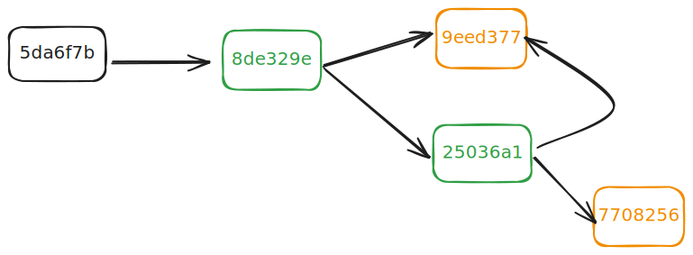
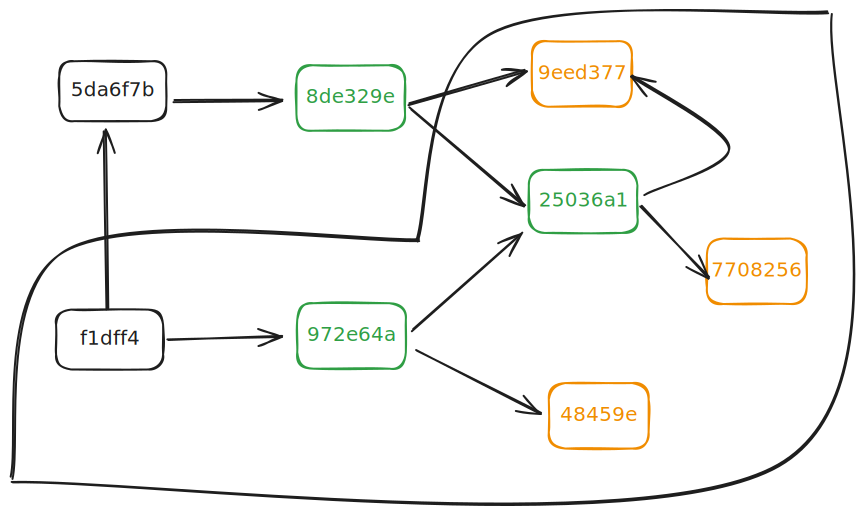
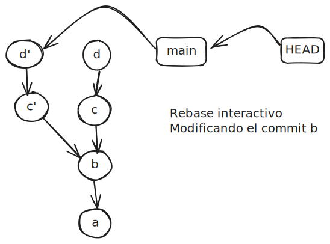
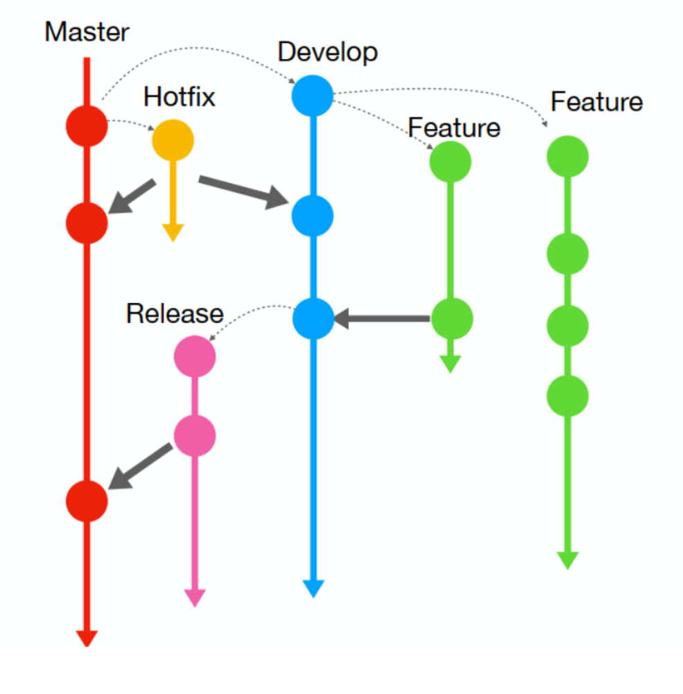
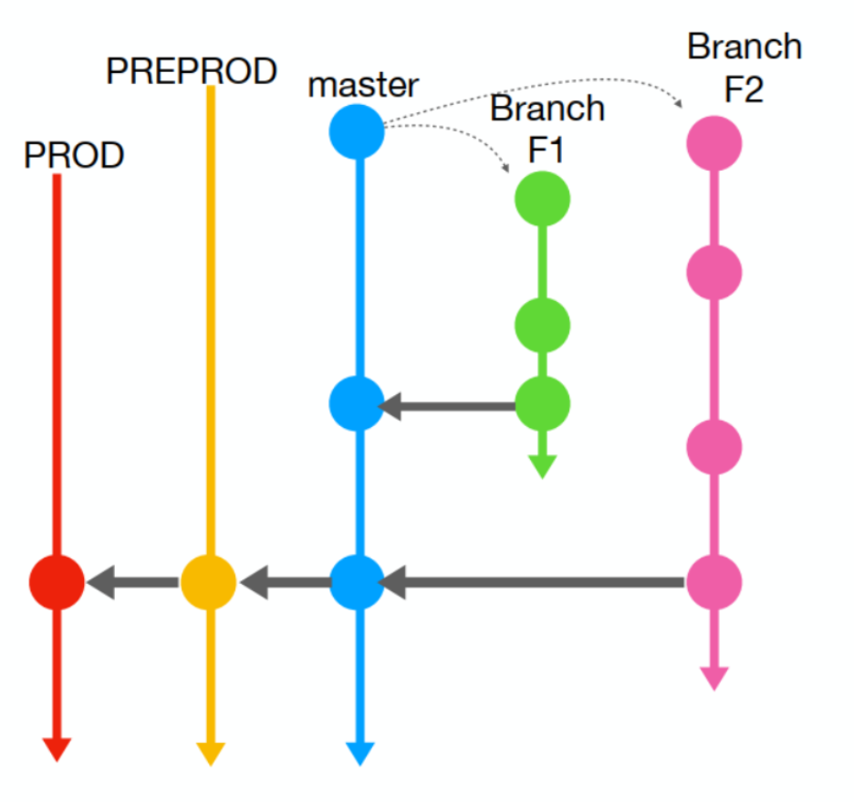

- [Git internals: Plumbing commands](#git-internals-plumbing-commands)
  - [La carpeta .git](#la-carpeta-git)
  - [Hashes: creación y lectura](#hashes-creación-y-lectura)
  - [Elementos de un repositorio- Primer commit](#elementos-de-un-repositorio--primer-commit)
  - [Modificación de un archivo](#modificación-de-un-archivo)
  - [References: Branches and HEAD](#references-branches-and-head)
- [Taller: Crear un nueva repositorio desde cero](#taller-crear-un-nueva-repositorio-desde-cero)
  - [Gestionando el repositorio con comandos plumbing](#gestionando-el-repositorio-con-comandos-plumbing)
  - [Creando un commit con comandos plumbing](#creando-un-commit-con-comandos-plumbing)
  - [En resumen del Taller](#en-resumen-del-taller)
- [Reescribiendo la historia (2)](#reescribiendo-la-historia-2)
  - [git command --amend](#git-command---amend)
  - [rebase interactivo](#rebase-interactivo)
    - [edit: modificando un commit](#edit-modificando-un-commit)
    - [squash y fixup: fusionando commits](#squash-y-fixup-fusionando-commits)
    - [drop: eliminando un commit](#drop-eliminando-un-commit)
  - [Otros comandos](#otros-comandos)
- [Trabajando en paralelo(2)](#trabajando-en-paralelo2)
  - [Cherrypick](#cherrypick)
  - [Tags](#tags)
    - [Operaciones con tags](#operaciones-con-tags)
  - [Patches](#patches)
- [Repositorios remotos (2)](#repositorios-remotos-2)
  - [Workflows](#workflows)
    - [GitFlow](#gitflow)
    - [GitLab Flow (Environment Branching)](#gitlab-flow-environment-branching)
    - [GitHub Flow, Feature Branching, Trunk Based Development](#github-flow-feature-branching-trunk-based-development)
    - [Ship-show-ask](#ship-show-ask)
- [Configuración de Git Hooks](#configuración-de-git-hooks)
  - [Configuración. gitconfig](#configuración-gitconfig)
  - [Hooks](#hooks)
- [Sub proyectos](#sub-proyectos)
- [Apéndice. Utilidades. Integración con otras herramientas y entornos](#apéndice-utilidades-integración-con-otras-herramientas-y-entornos)

## Git internals: Plumbing commands

Para conocer/manipular la estructura interna de Git, se utilizan los **plumbing commands** (comandos de fontanería).
Estos comandos son los que utiliza el propio Git internamente para construir los comandos de más alto nivel conocidos como **porcelain commands**.

### La carpeta .git

En términos de sistema de ficheros, un repositorio Git es una carpeta que incluye un directorio oculto `.git`.
Éste contiene toda la información necesaria para el control de versiones:

- **Objetos**: blobs, trees, commits, tags anotados
- **Referencias**: HEAD, master branch, tags ligeros
- Hooks: scripts que se ejecutan en determinados eventos
- Info y Logs: información extra sobre el repo y los commits
- fichero Index: área de preparación
- fichero de configuración local

```shell
tree .git
tree .git/objects /f
```

Se puede ver que el resultado muestra como la carpeta objects consta de una serie de cartetas/archivos que contienen los objetos de Git, por el momento.

- blobs (los archivo)
- trees (los directorios)
- commits (los snapshots)

Más adelante veremos un cuarto tipo de objeto, los tags (anotadas).

### Hashes: creación y lectura

La siguiente descripción refleja la forma de explicar estos concepto propuesta por _Paolo Perrotta_ en su conferencia _Understanding Git_, 3 diciembre 2016, disponible en [YouTube](https://www.youtube.com/watch?v=nHkLxts9Mu4).

En su capa más profunda Git es un **mapa de objetos** de acuerdo con un patrón clave/valor. Cada objeto es un cierto contenido (valor) que tiene un hash que lo identifica (clave).

Existe un comando de git que permite obtener el hash de un objeto, `git hash-object`. Este comando toma un archivo o cualquier contenido y devuelve el hash del objeto creado.

```shell
echo "Hello, World" | git hash-object --stdin
// 110fdc0ce1c7582e08f31e17bbcfdec1b50a478c
```

En este comando, el hash para un mismo contenido y en el mismo shell siempre será el mismo. El shell influye porque en cada uno de ellos el stdin es distinto.

El mismo contenido de un archivo siempre tendrá el mismo hash de 40 bytes, sin importar el nombre del archivo o la ubicación en el sistema de archivos. Este hash es único para el contenido con una probabilidad tan alta que se puede considerar único.

> Un hash SHA-1 es un número hexadecimal de 40 caracteres que se utiliza para identificar de forma única los objetos de Git. Se calcula a partir del contenido del objeto y de su tipo.

Si añadimos al comando la opción `-w`, para guardar el objeto obtendremos un mensaje de error porque no nos encontramos en un repositorio de Git.

```shell
echo "Hello, World" | git hash-object -w --stdin
// fatal: not a git repository (or any of the parent directories): .git
```

El mapa de hashes creado por Git se convierte en **persistente** gracias a la existencia de un **repositorio**, que es básicamente un directorio `.git/objects` que contiene todos los objetos de git. Cada objeto es guardado en un archivo con el nombre del hash del objeto.

Creamos un repositorio vacío y guardamos el objeto en el repositorio.

```shell
git init sample-repo
cd sample-repo
dir /a:hd // [= ls -a]
echo "Hello, World" | git hash-object -w --stdin //110fdc0ce1c7582e08f31e17bbcfdec1b50a478c
cd git
dir
cd objects
dir
cd 11
dir // 0fdc0ce1c7582e08f31e17bbcfdec1b50a478c
```

> El repositorio es una **base de datos de objetos** que se almacena en la carpeta oculta `.git`, que contiene los objetos de git en la carpeta objects.
> Por **cada hash** se crea una carpeta con los primeros dos caracteres del hash y dentro de esta carpeta se crea un fichero cuyo nombre es el resto del hash, que contiene la información correspondiente a ese hash en un formato comprimido.

De cada objeto guardado en un archivo se puede recuperar la información que contiene a partir del hash del objeto.

```shell
git cat-file -t 110fdc0 // blob
git cat-file -p 110fdc0 // Hello, World
```

Cada objeto es accesible por los 5 primeros caracteres de su hash:
la carpeta (2 caracteres) + inicio del fichero (3 caracteres)

### Elementos de un repositorio- Primer commit

Creamos un proyecto muy simple.

```shell
cd cook.book
```

C:.
│ menu.txt // Apple Pie
└───recipes
apple_pie.txt
readme.txt

```shell
cd cook.book
type menu.txt
// Apple Pie
type .\recipes\readme.txt
// Put your recipes in this folder, one for file.
type .\recipes\apple_pie.txt
//Apple Pie
```

Creamos un **repositorio** en el proyecto con un **commit inicial**.

```shell
cd cook.book
git init
git status
git add .
git commit -m "Initial commit"
```

Vemos el resultado en la carpeta objects del repositorio.

```shell
cd .git
cd dir /w // [25]   [5d]   [77]   [8d]   [9e]
cd 1f
```

Comprobamos los **logs** del repositorio

```shell
git log

commit 5da6f7b4682638317b18a5fe0f9edca98aeb1f7c (HEAD -> main)
Author: Alejandro Cerezo <alce65@hotmail.es>
Date:   Sat Sep 28 13:14:18 2024 +0200

    Initial commit
```

El **commit** corresponde al objeto 5d-a6f7b4682638317b18a5fe0f9edca98aeb1f7c que podemos leer con `git cat-file`.

```shell
git cat-file -p 5da6f7b

tree 8de329e56d2bf59ad7ce6df33df79e91a2a4a5a8
author Alejandro Cerezo <alce65@hotmail.es> 1727522058 +0200
committer Alejandro Cerezo <alce65@hotmail.es> 1727522058 +0200

Initial commit
```

Un resultado similar se consigue con el comando `git show --pretty=raw`, aunque en este caso se añade la información del diff.

```shell
git show 5da6f7b

commit 5da6f7b4682638317b18a5fe0f9edca98aeb1f7c
tree 8de329e56d2bf59ad7ce6df33df79e91a2a4a5a8
author Alejandro Cerezo <alce65@hotmail.es> 1727522058 +0200
committer Alejandro Cerezo <alce65@hotmail.es> 1727522058 +0200

    Initial commit

diff --git a/menu.txt b/menu.txt
new file mode 100644
```

Un commit no es mas que un texto, que como cualquier otro objeto de git, tiene un hash que lo identifica. En este texto se incluye la metadata del commit, como el autor, el committer, el mensaje al crearlo y la referencia uno o varios hashes.

En este caso, el commit apunta a un objeto de tipo tree que podemos leer con `git cat-file`.

```shell
git cat-file -p 8de329e

100644 blob 9eed377bbdeb4aa5d14f8df9cd50fed042f41023    menu.txt
040000 tree 25036a158dfdf583f672c11ef79f45c6b0e6347a    recipes
```

El **tree** guarda los nombres de los archivos y directorios (otros tree) que incluye, junto con sus hashes. En este caso, el tree apunta a dos objetos, uno de tipo blob y otro de tipo tree, que nuevamente podemos leer con `git cat-file`.

```shell
git cat-file -p 9eed377

Apple Pie
```

```shell
git cat-file -p 25036a1

100644 blob 9eed377bbdeb4aa5d14f8df9cd50fed042f41023    apple_pie.txt
100644 blob 7708256b70bf5e956ea609a785911a31fc14929f    readme.txt
```

En el caso del tree, la misma información se puede obtener con `git ls-tree`.

```shell
git ls-tree 8de329e

100644 blob 9eed377bbdeb4aa5d14f8df9cd50fed042f41023    apple_pie.txt
100644 blob 7708256b70bf5e956ea609a785911a31fc14929f    readme.txt
```

El objeto tree `25036a1` apunta a dos objetos de tipo blob que . Uno de ellos es nuevamente 9eed377, porque el contenido de `apple_pie.txt` es el mismo que el de `menu.txt`. El otro objeto blob lo podemos leer con `git cat-file`.

```shell
git cat-file -p 7708256

Put your recipes in this folder, one for file.
```



### Modificación de un archivo

Añadimos otra línea en el archivo `menu.txt` y comprobamos los cambios.

```shell
cd ..\..\..\cook.book
echo Cheesecake>> menu.txt
type menu.txt
```

Creamos un nuevo commit para incorporar los cambios.

```shell
git add .
git commit -m "Add Cheesecake to menu"
git log

commit f1dff43f97543e83cab3f52f054cdcf9b26e8d55 (HEAD -> main)
Author: Alejandro Cerezo <alce65@hotmail.es>
Date:   Sat Sep 28 14:03:08 2024 +0200

    Add Cheesecake to menu
```

De nuevo, el commit es un objeto de tipo que podemos leer con `git cat-file`.

```shell
git cat-file -p f1dff4

tree 972e64a00a72e413bd158352ab3e6e98461bfbea
parent 5da6f7b4682638317b18a5fe0f9edca98aeb1f7c
author Alejandro Cerezo <alce65@hotmail.es> 1727524988 +0200
committer Alejandro Cerezo <alce65@hotmail.es> 1727524988 +0200

Add Cheesecake to menu
```

El commit apunta a un objeto de tipo commit, el commit anterior y a un nuevo objeto de tipo tree que podemos leer con `git cat-file`.

```shell
git cat-file -p 972e64a

100644 blob 48459e5685c4561d0fa6e26a7371041e982c0ff4    menu.txt
040000 tree 25036a158dfdf583f672c11ef79f45c6b0e6347a    recipes
```

El tree sigue siendo el mismo, pero el objeto blob `48459e5` es diferente al anterior.
Si lo leemos con `git cat-file` vemos que contiene la nueva línea.

```shell
git cat-file -p 48459e5

Apple Pie
Cheesecake
```



Utilizando un commit como punto de entrada es posible recorrer todos los objetos de un repositorio de git correspondientes al momento en que se creó el commit, reconstruyendo a partir de ellos el estado del proyecto en ese momento, lo que denominamos una **snapshot del proyecto**.

Cuando un fichero no cambia, git no guarda una nueva versión del fichero, sino que guarda una referencia al fichero anterior. De esta forma, git ahorra espacio en disco y tiempo de ejecución.

En resumen, un commit es un objeto que apunta a un objeto de tipo tree que apunta a uno o varios objetos de tipo blob. Un objeto de tipo blob es un archivo, un objeto de tipo tree es un directorio y un objeto de tipo commit es un snapshot del proyecto en un momento dado.

> Técnicamente, un repositorio es un **grafo dirigido acíclico** donde los nodos son objetos de git (de tipo commit, tree o blob) y las aristas son referencias entre ellos. Con ello se consigue un **filesystem** de alto nivel, inmutable, eficiente y seguro, por encima del filesystem del sistema operativo. Además, gracias a los commits, se convierte en un **version filesystem**, con **control de versiones**.

### References: Branches and HEAD

Las **ramas** en git son simplemente **punteros a commits**. En detalle son archivos de texto plano almacenados en la carpeta `.git/refs/heads` que contienen el hash del commit al que apuntan.

```shell
dir .git\refs\heads /b

main
```

```shell
type .git\refs\heads\main

f1dff43f97543e83cab3f52f054cdcf9b26e8d55
```

**Crear una nueva rama** se reduce a crear un nuevo archivo en la carpeta `.git/refs/heads` con el nombre de la rama y como contenido el hash del commit un commit, que de momento será el mismo que en la rama anterior.

```shell
git branch feature
dir .git\refs\heads /b

feature
main
```

```shell
type .git\refs\heads\feature

f1dff43f97543e83cab3f52f054cdcf9b26e8d55
```

Si en el SO creamos un fichero con el nombre de la rama y el contenido del hash del commit, git reconocerá la rama.

```shell
echo f1dff43f97543e83cab3f52f054cdcf9b26e8d55 > .git\refs\heads\bad-way
git branch

bad-way
feature
* main
```

```shell
del .git\refs\heads\bad-way

git branch

feature
* main
```

La rama main aparece indicada con un asterisco porque es la **rama actual** (current branch). Eso es lo que indica el **puntero `HEAD`**

El puntero `HEAD` es un archivo de texto plano almacenado en la carpeta `.git` que contiene el nombre de la rama actual. Como se ve en el contenido del archivo, es una referencia a una referencia

```shell
type .git\HEAD
ref: refs/heads/main
```

En realidad por cada rama se crea una referencia simbólica en la carpeta `.git/refs/heads` que apunta al hash del commit al que apunta la rama.

```shell
dir .git\refs\heads /b

feature
main
```

```shell
type .git\refs\heads\main

f1dff43f97543e83cab3f52f054cdcf9b26e8d55
```

Como veremos más adelante, algunos de los comandos más importantes de Git son aquellos que permiten **mover el puntero `HEAD`** y **cambiar de rama**.

## Taller: Crear un nueva repositorio desde cero

En su libro _Gitting Things Done_, 2021, disponible en [freecodecamp](https://www.freecodecamp.org/news/gitting-things-done-book/), _Omer Rosenbaum_ propone un interesante ejercicio destinado a comprender a fondo en que consiste un repositorio deGit, consistente en crearlo desde cero y añadirle un primer commit.

Creamos una nueva carpeta y accedemos a ella.

```shell
mkdir scratch-repo
cd scratch-repo
```

Como es previsible git status nos indica que no estamos en un repositorio de git.

```shell
git status
// fatal: not a git repository (or any of the parent directories): .git
```

Creamos la estructura de carpetas básica de un repositorio.

```shell
mkdir -p .git
cd .git
mkdir objects
mkdir refs
cd refs
mkdir heads
cd..
cd..
tree
```

Obtenemos la siguiente estructura y volvemos a comprobar el estado del repositorio.

```shell
C:.
└───.git
    ├───objects
    └───refs
        └───heads
```

```shell
git status
fatal: not a git repository (or any of the parent directories): .git
```

El paso que nos falta es crear el fichero `HEAD` en la carpeta `.git` que apunte a la rama `main`.

```shell
echo ref: refs/heads/main > .git\HEAD
```

En este punto, git ya reconoce la carpeta como un repositorio.

```shell
git status
// On branch main
// No commits yet
// nothing to commit (create/copy files and use "git add" to track)
```

A pesar de que no existe la rama main en la carpeta `refs/heads/main`, git reconoce la rama `main` como la rama actual porque la tiene referenciada en el fichero HEAD.

### Gestionando el repositorio con comandos plumbing

Hemos creado el repositorio simplemente con los comandos del SO, sin utilizar `git init`. Vamos a añadir un fichero al área de preparación y hacer el primer commit, pero sin utilizar los comandos porcelain, `git add` o `git commit`. En su lugar utilizaremos los comandos plumbing que subyacen a los de más alto nivel que utilizamos habitualmente.

Para crear un objeto blob, utilizamos el comando `git hash-object`, tal y como ya hemos visto, pasándole información desde el stdin.

```shell
echo Aprendiendo Git | git hash-object --stdin
// 7b31213ab333bd7eab40ce5de1185bd6565f120e
```

También sabemos que el modificados -w guarda el objeto en el repositorio.

```shell
echo Aprendiendo Git | git hash-object -w --stdin
tree .git
dir .git\objects\7b
```

```shell
C:.
└───.git
    ├───objects
    │   └───7b // 31213ab333bd7eab40ce5de1185bd6565f120e
    └───refs
        └───heads
```

Se ha creado un objeto blob en la carpeta `objects` del repositorio, con una sub-carpeta `7b` y un fichero con el nombre del resto del hash del objeto.
El comando `git cat-file` nos permite leer el tipo y el contenido del objeto.

```shell
git cat-file -t 7b31213 // blob
git cat-file -p 7b31213 // Aprendiendo Git
```

A pesar de ello, vemos que git status no refleja esta cambio

```shell
git status
```

Para añadir el objeto al área de preparación, necesitamos crear el indice, el fichero que contiene información sobre los hashes de los objetos que se han añadido al área de preparación. Para ello utilizaremos el comando `git update-index`.

```shell
git update-index --add --cacheinfo 100644 7b31213ab333bd7eab40ce5de1185bd6565f120e README.md
```

Indicamos la mascara del fichero a nivel del SO (100644), el hash del objeto y el nombre del fichero, que aun no existe.

EL resultado a nivel de git, es

```shell
git status

// Changes to be committed: new file:   README.md
// Changes not staged for commit: deleted:    README.md
```

El fichero está en el area de preparación, pero no en el directorio de trabajo. Para añadirlo al directorio de trabajo, crearemos el fichero con el mismo contenido que el objeto blob.

```shell
echo Aprendiendo Git > README.md
```

Y comprobamos que el fichero ha sido añadido al directorio de trabajo y aparece como staged en el área de preparación, seg´´un nos indica `git status`.

```shell
git status

// Changes to be committed: new file:   README.md
```

### Creando un commit con comandos plumbing

El paso de la información desde la staged area al repositorio exige que creemos un objeto tree que contenga la información de los objetos que se han añadido al área de preparación. Para ello utilizamos el comando `git write-tree`. Para comprobar el contenido del objeto tree, utilizamos el comando `git cat-file`.

```shell
git write-tree // 3976f2ec82f4d61250cac1b1b26fa053439dbcae
git cat-file -t 3976f2e // tree
git cat-file -p 3976f2e // 100644 blob 7b31213ab333bd7eab40ce5de1185bd6565f120e    README.md
```

A nivel de carpetas, veremos que se a creado un objeto tree en la carpeta `objects` del repositorio.

```shell
tree .git
dir .git\objects\39
```

```shell
C:.
└───.git
    ├───objects
    │   └───39 // 76f2ec82f4d61250cac1b1b26fa053439dbcae
    │   └───7b // 31213ab333bd7eab40ce5de1185bd6565f120e
    └───refs
        └───heads
```

A partir del objeto tree, creamos un commit con el comando `git commit-tree`. Para ello necesitamos el hash del objeto tree, que ya conocemos.

```shell
git commit-tree 3976f2ec82f4d61250cac1b1b26fa053439dbcae -m "Initial commit" // 79aa70c84454bd9e928f0224139170837c8563c8
```

Nuestro objeto commit puede comprobarse con `git cat-file`.

```shell
git cat-file -t 79aa70c // commit
git cat-file -p 79aa70c // tree 3976f2ec82f4d61250cac1b1b26fa053439dbcae
```

Y nuestro repositorio refleja su existencia a nivel de carpetas pero no en el resultado de `git status`.

```shell
tree .git
dir .git\objects\79
```

```shell
C:.
└───.git
    ├───objects
    │   └───39 // 76f2ec82f4d61250cac1b1b26fa053439dbcae
    │   └───79 // aa70c84454bd9e928f0224139170837c8563c8
    │   └───7b // 31213ab333bd7eab40ce5de1185bd6565f120e
    └───refs
        └───heads
```

```shell
git status
// Changes to be committed:  new file:   README.md
```

El problema es simplemente que no se ha actualizado el puntero de la rama `main` al nuevo commit. En realidad, el fichero refs/heads/main al que hace referencia HEAD ni siquiera existe. Debemos crearlo con el hash del nuevo commit.

```shell
echo 79aa70c84454bd9e928f0224139170837c8563c8 > .git\refs\heads\main
```

De esta forma tanto `git status` como `git log` reflejarán la existencia del nuevo commit.

```shell
git status
// nothing to commit, working tree clean
git log
// commit 79aa70c84454bd9e928f0224139170837c8563c8 (HEAD -> main)
```

### En resumen del Taller

Crear un nueva repositorio desde cero ha sido posible gracias a los comandos del SO y a los comandos de bajo nivel de Git, los **plumbing commands**.

Hemos creado un objeto blob, un objeto tree y un objeto commit, y hemos actualizado los punteros de la rama y HEAD para reflejar la existencia del nuevo commit. Pare ello hemos usado los siguientes comandos:

- `git hash-object`: para crear un objeto blob
- `git update-index`: para añadir el objeto al área de preparación
- `git write-tree`: para crear un objeto tree
- `git commit-tree`: para crear un objeto commit
- `git cat-file`: para leer el contenido de los objetos

## Reescribiendo la historia (2)

### git command --amend

El comando `git commit --amend` permite modificar el último commit. Se puede utilizar para

- cambiar el mensaje del commit
- añadir ficheros al commit
- modificar ficheros del commit

```shell
git commit --amend
```

Si no se añade ningún fichero, se abrirá el editor de texto para modificar el mensaje del commit.
Si han añadido ficheros en el stage, se añadirán al commit.

```shell
git add <file>
git commit --amend
```

En realidad, `git commit --amend` crea un nuevo commit con los cambios del commit anterior y los nuevos cambios. El commit anterior dejara de estar vinculado a ninguna rama y se eliminará en la proxima operación del garbage collector.

El uso de amend debe limitarse a "cambios en el commit anterior", como corregir errores en el mensaje del commit, modificar los ficheros o añadir puntualmente otros nuevos, claramente vinculados a los anteriores. Para cambios de mayor envergadura es mejor práctica crear un nuevo commit.

### rebase interactivo

Uno de los comando más potentes de Git es el rebase interactivo. Permite reescribir la historia de un repositorio, cambiando el orden de los commits, modificando los mensajes de los commits, eliminando commits, fusionando commits, etc.

```shell
git rebase -i <primer commit no incluido en el rebase >
git rebase -i HEAD~4
```

Como resultado se abre un editor de texto con una lista de commits que se van a reescribir. Cada línea tiene un comando y un commit.

```sh
pick 1ecb721 Mensaje del commit HEAD~3
pick 07ad6a9 Mensaje del commit HEAD~2
pick 7515002 Mensaje del commit HEAD~1
pick 7c4668d Mensaje del último commit

 Rebase 9457f43..7c4668d onto 9457f43 (4 commands)
#
 Commands:

 p, pick <commit> = use commit
 r, reword <commit> = use commit, but edit the commit message
 e, edit <commit> = use commit, but stop for amending
 s, squash <commit> = use commit, but meld into previous commit
 f, fixup [-C | -c] <commit> = like "squash" but keep only the previous
 commit's log message, unless -C is used, in which case
 keep only this commit's message; -c is same as -C but
 opens the editor
 x, exec <command> = run command (the rest of the line) using shell
 b, break = stop here (continue rebase later with 'git rebase --continue')
 d, drop <commit> = remove commit
 l, label <label> = label current HEAD with a name
 t, reset <label> = reset HEAD to a label
 m, merge [-C <commit> | -c <commit>] <label> [ <oneline>]
 create a merge commit using the original merge commit's
 message (or the oneline, if no original merge commit was
 specified); use -c <commit> to reword the commit message
 u, update-ref <ref> = track a placeholder for the <ref> to be updated
 to this position in the new commits. The <ref> is
 updated at the end of the rebase
#

 These lines can be re-ordered; they are executed from top to bottom.
#
 If you remove a line here THAT COMMIT WILL BE LOST.
#
 However, if you remove everything, the rebase will be aborted.
#
```

Los comandos más comunes son

- pick: utiliza el commit
- reword: utiliza el commit, pero permite cambiar el mensaje
- edit: utiliza el commit, pero para en él para hacer cambios
- squash: fusiona el commit con el anterior
- fixup: fusiona el commit con el anterior, pero mantiene el mensaje del anterior
- drop: elimina el commit

También es posible reordenar los commits simplemente cambiando el orden de las líneas.

A partir del primer commit que cambia, todos los commits se deben reescribir, dado que su inmutabilidad impide ningún cambio en ellos.

Por ejemplo si se quiere cambiar el mensaje de un commit, se cambia el comando pick por reword. Al cerrar el editor se abrirá otro editor con el mensaje del commit, que se puede modificar.

```shell
git rebase -i HEAD~4
```

```shell
pick 1ecb721 Mensaje del commit HEAD~3
reword 07ad6a9 Mensaje del commit HEAD~2
pick 7515002 Mensaje del commit HEAD~1
pick 7c4668d Mensaje del último commit
```

```shell
Mensaje del commit HEAD~2
# Información de que estamos en el editor de reword
```



#### edit: modificando un commit

Edit utiliza el commit indicado para hacer cambios, incluyendo eliminar parte del contenido, añadir más contenido o separar el contenido en diversos commits. Al cerrar el editor, se abrirá una consola de Git en la que se pueden hacer los cambios deseados.

```shell
git rebase -i HEAD~4
```

```shell
pick 1ecb721 Mensaje del commit HEAD~3
pick 07ad6a9 Mensaje del commit HEAD~2
edit 7515002 Mensaje del commit HEAD~1
pick 7c4668d Mensaje del último commit
```

```shell
Stopped at 7515002...  Mensaje del commit HEAD~1
You can amend the commit now, with

  git commit --amend

Once you are satisfied with your changes, run

  git rebase --continue
```

La salida de git status nos indicara en que commit estamos y que podemos hacer cambios en él.

```shell
interactive rebase in progress; onto 9457f43
Last command done (1 command done):
   edit 1ecb721 Add new Huskies
Next commands to do (3 remaining commands):
   pick 07ad6a9 Add and configure github action
   pick 7515002 Simulate lint fail
  (use "git rebase --edit-todo" to view and edit)
You are currently editing a commit while rebasing branch 'feature/actions' on '9457f43'.
  (use "git commit --amend" to amend the current commit)
  (use "git rebase --continue" once you are satisfied with your changes)

nothing to commit, working tree clean
```

Como estamos editando el commit HEAD~1, empezaremos por un reset con su valor por defecto --mixed enviando todo su contenido al area de trabajo.

```shell
git reset HEAD~1
```

A partir de aquí podemos hacer los cambios que deseemos, añadir ficheros, eliminar ficheros, modificar ficheros, etc. y almacenarlos en tantos commits como necesitemos.

```shell
git add <files>
git commit -m "Mensaje del primer commit modificado"
git add <other files>
git commit -m "Mensaje del segundo commit modificado"
```

Una vez que hemos terminado de hacer los cambios, podemos continuar con el rebase

```shell
git rebase --continue
```

#### squash y fixup: fusionando commits

Si se quiere fusionar dos o más commits, se puede utilizar squash o fixup. La diferencia entre ambos es que squash mantiene el mensaje del commit que se va a fusionar, mientras que fixup lo elimina.

```shell
git rebase -i HEAD~4
```

```shell
pick 1ecb721 Mensaje del commit HEAD~3
pick 07ad6a9 Mensaje del commit HEAD~2
squash 7515002 Mensaje del commit HEAD~1
pick 7c4668d Mensaje del último commit
```

El comando **squash** fusiona el commit HEAD~1 con el commit anterior, HEAD~2. Al cerrar el editor, se abrirá otro editor con el mensaje de los dos commits, que se puede modificar, Seleccionando alguno de los mensajes o creando uno nuevo.

Por su parte el comando **fixup** fusiona el commit HEAD~1 con el commit anterior, HEAD~2, pero mantiene el mensaje del commit anterior, sin darnos opción a cambiarlo.

#### drop: eliminando un commit

Al indicar drop, el commit desaparece de la lista de commits a reescribir.

```shell
git rebase -i HEAD~4
```

```shell
pick 1ecb721 Mensaje del commit HEAD~3
pick 07ad6a9 Mensaje del commit HEAD~2
drop 7515002 Mensaje del commit HEAD~1
pick 7c4668d Mensaje del último commit
```

El resultado es que el commit HEAD~1 desaparece de la lista de commits a reescribir. Como consecuencia, la información de ese commit se pierde completamente.

Un posible caso sería eliminar información sensible que por error se ha incluido en un commit.

### Otros comandos

- git stash: guarda los cambios en un commit temporal, que se almacena en una pila de cambios. Se puede recuperar en cualquier momento.
- git clean: elimina los ficheros no rastreados por Git
  - git clean -n: muestra los ficheros que se eliminarán
  - git clean -f: elimina los ficheros
- git revert: crea un nuevo commit que deshace los cambios de un commit anterior
- git bisect: busca un commit que introdujo un error

## Trabajando en paralelo(2)

### Cherrypick

El comando cherry-pick "copia" un commit, creando un nuevo commit en el branch actual con el mismo mensaje y patch que otro commit. Es un rebase de un solo commit.

Si en la rama actual se quiere añadir un commit de otra rama, se puede hacer con el comando `git cherry-pick`

```shell
git cherry-pick <commit>
```

La principal utilidad de cherry-pick es la de añadir a una o varias ramas un hotfix (solución de un problema urgente) que se ha hecho en otra rama, sin tener que hacer un merge.

El hotfix debe ser un commit atómico, es decir, que no dependa de otros commits. Esto sería una buena práctica en cualquier caso, pero en el caso de un hotfix es imprescindible.

### Tags

Los tags son referencias a un commit específico. Se utilizan para marcar versiones, releases, etc. Son otra forma de referenciar un commit, como una rama pero hay una diferencia entre ambas:

- las ramas son dinámicas, cambian con cada commit que se hace en ellas. Su objetivo es seguir el desarrollo del proyecto.

- los tags son estáticos, no cambian ni se mueven con el tiempo. Una vez aplicado, se debe dejar tal cual.

Existen dos tipos de tags:

- Ligeras: Se crean sin modificador y no tienen mensaje. Son simplemente un puntero a un commit, igual que una rama.

Para crear un tag se utiliza el comando `git tag`

```shell
git tag v1.0 <referencia al commit>
```

- Anotados: Se crean con el modificador -a y se les puede añadir un mensaje. Se almacenan como objetos completos en la base de datos de Git. Son pos tanto identificadas por su hash (checksum); contienen el nombre, email y fecha del tagger. Se pueden firmar y verificar. Son el formato recomendado
  Are stored as full objects in the Git database. They are checksummed; contain the tagger name, email and date. Can be signed and verified.

Para crear un tag se utiliza el comando `git tag` con el modificador -a

```shell
git tag -a v1.0 -m "Primera versión"
```

#### Operaciones con tags

Para listar los tags se utiliza el comando `git tag`

```shell
git tag
```

Pare mostrar un tag creado se utiliza el comando `git show`

```shell
git show v1.0
```

Para subir un tag al repositorio remoto se utiliza el comando `git push`

```shell
git push origin v1.0
```

También es posible subir todos los tags al repositorio remoto:

```shell
git push origin --tags
```

Para usar un tag, se puede hacer checkout a un tag

```shell
git checkout v1.0
```

### Patches

Los patches son ficheros que contienen los cambios entre dos commits. Se pueden generar con el comando `git format-patch`

```shell
git format-patch HEAD~2..HEAD
```

Para aplicar un patch se utiliza el comando `git apply`

```shell
git apply 0001-Add-new-feature.patch
```

## Repositorios remotos (2)

### Workflows

#### GitFlow

El GitFlow es un modelo de ramificación que se basa en dos ramas principales:

- master: rama principal, estable, que contiene el código en producción
- develop: rama de desarrollo, inestable, que contiene el código en desarrollo

Además, se utilizan otras ramas auxiliares:

- feature: rama de desarrollo de una nueva funcionalidad
- release: rama de preparación de una nueva versión
- hotfix: rama de corrección de errores en producción

El flujo de trabajo es el siguiente:

1. Se crea una rama feature a partir de develop
2. Se desarrolla la funcionalidad en la rama feature
3. Se fusiona la rama feature en develop
4. Se crea una rama release a partir de develop
5. Se prepara la nueva versión en la rama release
6. Se fusiona la rama release en master
7. Se fusiona la rama release en develop

En caso de que aparezca la necesidad de corregir un error en producción,

1. se crea una rama hotfix a partir de master
2. se corrige el error
3. se fusiona la rama hotfix en master y develop.



Entre las ventajas del GitFlow se encuentran:

- Facilita la colaboración en equipos grandes
- Hay mucha documentación y herramientas que lo soportan
- Es un modelo muy extendido
- Las ramas están muy bien definidas y organizadas

Entre las desventajas del GitFlow se encuentran:

- Es un modelo muy complejo, especialmente para equipos pequeños
- Puede ser difícil de entender y de implementar
- Si hay un rollback, puede ser complicado de gestionar y se pierde todo el valor entregado
- Las ramas feature pueden ser muy largas y difíciles de gestionar
- Puede haber problemas de integración si no se hace un merge frecuente
- No esta muy bien adaptado a la filosofía de entrega continua (CI/CD)

Refetencias

- [Git Flow](https://nvie.com/posts/a-successful-git-branching-model/)
- [Git Flow Cheatsheet](https://danielkummer.github.io/git-flow-cheatsheet/)

#### GitLab Flow (Environment Branching)

El GitLab Flow es un modelo de ramificación que se basa en las siguientes ramas:

- environment: ramas de entorno, que contienen el código en producción, preproducción, etc.
- master: rama principal, estable, que contiene el código en desarrollo
- feature: ramas de desarrollo de una nueva funcionalidad
- hotfix: ramas de corrección de errores en producción

El flujo de trabajo es el siguiente:

1. Se crea una rama feature a partir de master
2. Se desarrolla la funcionalidad en la rama feature
3. Se fusiona la rama feature en master
4. Se crea una rama environment a partir de master
5. Se despliega la rama environment en un entorno de pruebas
6. Se prueba la funcionalidad en el entorno de pruebas
7. Se fusiona la rama environment en producción
8. Se despliega la rama environment en producción



Entre las ventajas del GitLab Flow se encuentran:

- Facilita la colaboración en equipos grandes
- Master nunca esta roto, siempre está en producción
- Los environment branches permiten tener entorno para probar distintas configuraciones

Entre las desventajas del GitLab Flow se encuentran:

- Es un modelo muy complejo, especialmente para equipos pequeños
- Las ramas feature pueden ser muy largas y difíciles de gestionar
- Si hay un rollback, puede ser complicado de gestionar y se pierde todo el valor entregado
- No esta muy bien adaptado a la filosofía de entrega continua (CI/CD)

Referencias

- [GitLab Flow](https://about.gitlab.com/topics/version-control/what-are-gitlab-flow-best-practices/)- - [Environment and other Branching Strategies](https://www.javacodegeeks.com/2015/11/git-branching-strategies.html)

#### GitHub Flow, Feature Branching, Trunk Based Development

El GitHub Flow, con distintas variantes conocidas como Feature Branching o Trunk Based Development, es un modelo de ramificación que se basa en las siguientes ramas:

- master: rama principal, estable, que contiene el código en producción
- feature: ramas cortas de de desarrollo de una nueva funcionalidad

El flujo de trabajo es el siguiente:

1. Se crea una rama feature a partir de master
2. Se desarrolla la funcionalidad en la rama feature
3. Se fusiona la rama feature en master
4. Se despliega la rama master en producción
5. En algunas variantes del modelo, se aplican tags a determinados commits de master para marcar las versiones
6. Se repite el proceso con cada nueva rama feature


Entre las ventajas del GitHub Flow se encuentran:

- Es un modelo muy sencillo, fácil de entender y de implementar
- Facilita la colaboración en equipos pequeños
- Master nunca esta roto, siempre está en producción
- Las ramas feature son cortas y fáciles de gestionar
- Se adapta muy bien a la filosofía de entrega continua (CI/CD)

Entre las desventajas del GitHub Flow se encuentran:

- Puede no ser adecuado para equipos grandes
- Es muy importante que las ramas de feature sean cortas
- Al aplicarse la filosofía de CI/CD y desplegar master en producción, la integración de estar bien automatizada y los tests se vuelven críticos

Referencias

- [GitHub Flow](https://guides.github.com/introduction/flow/)
- [Understanding the GitHub Flow](https://github.com/a-a-ron/Github-Flow)
- [Trunk based ](https://trunkbaseddevelopment.com/)

#### Ship-show-ask

Es un modelo de ramificación propuesto más recientemente que se basa en tres procedimientos diferentes

- Ship: se desarrolla el código directamente en master y por tanto se envía inmediatamente a producción
- Show: se desarrolla el código en una rama feature y se muestra a los interesados antes de fusionarla en master, pero sin someterla a un proceso de code review y aprobación
- Ask: se desarrolla el código en una rama feature y se somete a un proceso de code review y aprobación antes de fusionarla en master, como se hace en el GitHub Flow

El desarrollador cobra un mayor protagonismo al decidir cual de las tres estrategias aplicar en cada caso, en función de la criticidad del cambio, la complejidad del código, la urgencia del despliegue, etc.

Referencias

- [ship-show-ask](https://martinfowler.com/articles/ship-show-ask.html)

## Configuración de Git Hooks

### Configuración. gitconfig

- .alias
- Editor
- Coloreado comandos
- Formato salida comandos
- Otras opciones

### Hooks

- Cómo crear
- hooks de lado cliente: commits, emails, rebase, ...
- hooks de lado servidor: prereceive, postreceive, update

## Sub proyectos

- Crear submodules
- workflow de commits
- git submodule status recursive
- git submodule foreach ...

## Apéndice. Utilidades. Integración con otras herramientas y entornos

- GitK, GitG y git gui | git log graph | formato git log
- IntelliJ
- SourceTree
- Github
- GitLab
- Bitbucket
